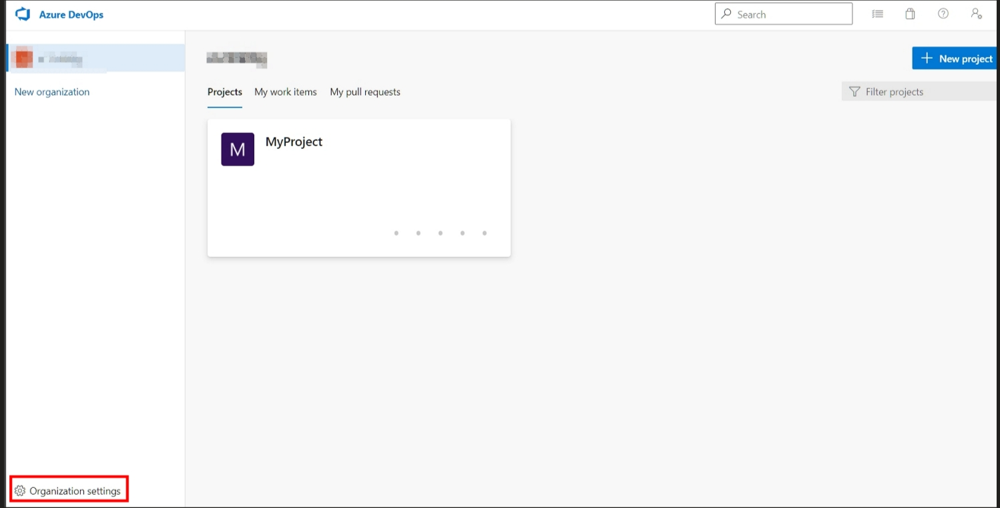
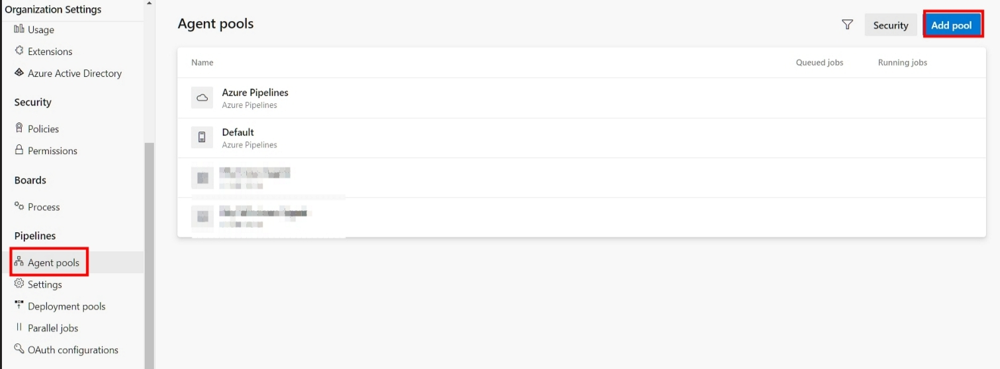
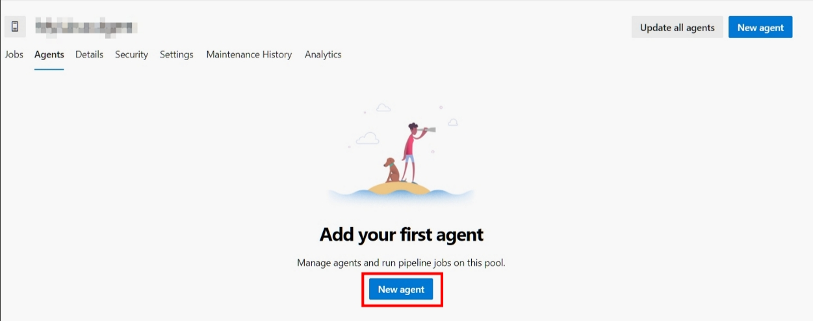
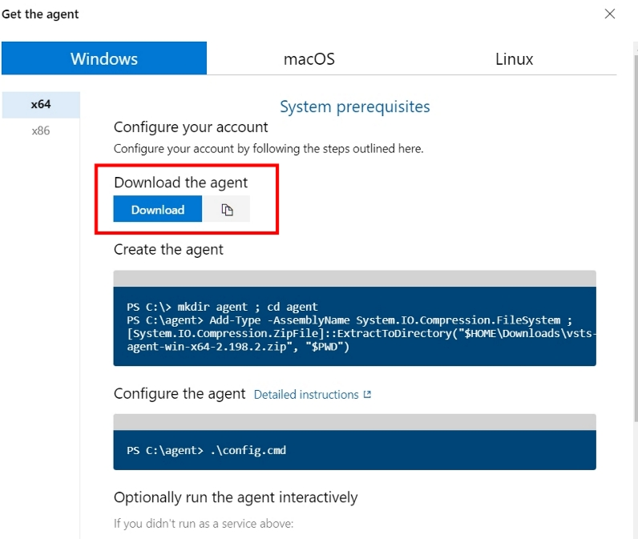
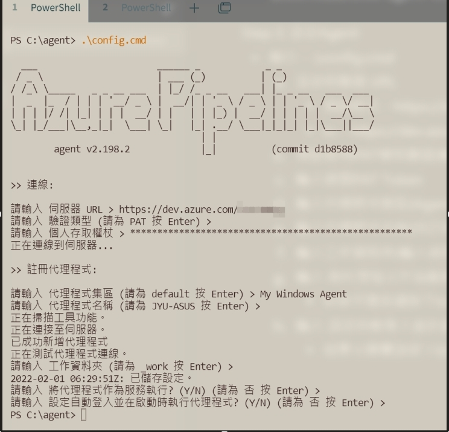
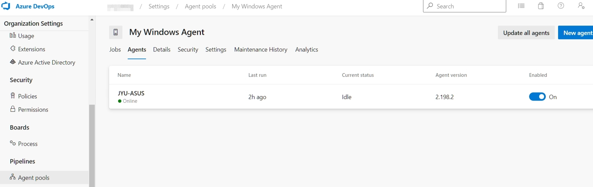

<!--more-->


注意事項：
* 需要確認裝載電腦環境是否有運作必要套件，Ex：執行Asp.Net.Core範本就需要安裝Dotnet SDK。
* 需要設定PAT(Personal Access Tokens)許可權證，讓Self-hosted Agent能夠與遠端連線操作。
* 如果需要重新配置Agent代理程式，需要刪除掉原始配置，才能在進行配置操作。 (參考4)
* 開啟`PowerShell`執行操作指令。

### Step 1. 新增PAT(Personal Access Tokens)許可權證

<p>
新增完畢產生Token會用在後面初次設定Agent程式。
</P>


### Step 2. 下載Agent程式

* `Organization settings` -- > 選取 `Agent pools` --> 點擊 `Add pool` 按鈕



* `Pool Type` 選擇`Self-hosted`，自訂`Name`內容設定該Agent集區名稱。
<br/>


* 點進建立自訂Agent集區內，選取`Agents`區塊 --> 點擊`New agent`
<br/>



* 選擇`Windows` --> `Download the agent` --> 點擊`Download` 按鈕
<br/>



### Step 3. 建立Agent程式存放目錄與解壓縮

此筆記在`PowerShell`進行操作，也可手動進行建置存放目錄與解壓縮至指定目錄。

* 在`C:\`底下操作指令，建立存放目錄並切換至該目錄底下
  ```
  mkdir agent ; cd agent
  ```
* 將下載Agent程式壓縮檔解壓縮至 `C:\agent`  
  ```
  Add-Type -AssemblyName System.IO.Compression.FileSystem ; [System.IO.Compression.ZipFile]::ExtractToDirectory("$HOME\Downloads\vsts-agent-win-x64-2.198.2.zip", "$PWD")
  ```
  - 此筆記下載壓縮檔名稱為`vsts-agent-win-x64-2.198.2.zip`，每一次下載可能都會不一樣，需再注意壓縮檔案名稱。

### Step 4. 設定Agent程式(初次執行前須設置一次此步驟)

`PowerShell`需再Agent程式放置目錄位置底下。

* 執行設定指令：
  ```
  .\config.cmd
  ```
* 設定伺服器 URL
  * 預設格式：https://dev.azure.com/`{your-organization}`
  * `{your-organization}` 輸入自己組織名稱
* 在`PwoerShell`執行指令期間進行以下設定
  1. 預設使用PAT權杖驗證(輸入視窗會提示`請為 PAT 按 Enter`)
  2. 輸入建置PAT Token
  3. 輸入代理程式集區(Agent Tool內設定集區名稱)
  4. 輸入代理程式名稱(自訂命名)
  5. 輸入工作資料夾(輸入視窗會提示`請為 _work 按 Enter`)
  6. 輸入將代理程式作為服務執行? (Y/N)
    * 如果不需要請按下Enter，輸入視窗會提示`請為 否 按 Enter`
  7. 輸入設定自動登入並在啟動時執行代理程式? (Y/N)
    * 如果不需要請按下Enter，輸入視窗會提示`請為 否 按 Enter`



### Step 5. 執行Agent代理程式

`PowerShell`需再Agent程式放置目錄位置底下。

* 執行設定指令：
  ```
  .\run.cmd
  ```
* 如果要終止程式，按下Ctrl + C即可。

可在Agent Tool集區內檢視目前Agent程式是否有在運作中。


---

#### 相關參考
1. [參考自我裝載 Windows 代理程式 - 非Service運作模式](https://docs.microsoft.com/zh-tw/azure/devops/pipelines/agents/v2-windows?view=azure-devops#download-and-configure-the-agent)
2. [確認檢查必要條件](https://docs.microsoft.com/zh-tw/azure/devops/pipelines/agents/v2-windows?view=azure-devops#check-prerequisites)
3. [使用個人存取權杖進行驗證 (PAT) ](https://docs.microsoft.com/zh-tw/azure/devops/pipelines/agents/v2-windows?view=azure-devops#authenticate-with-a-personal-access-token-pat)
4. [移除並重新設定代理程式](https://docs.microsoft.com/zh-tw/azure/devops/pipelines/agents/v2-windows?view=azure-devops#remove-and-re-configure-an-agent)
5. [下載並設定代理程式](https://docs.microsoft.com/zh-tw/azure/devops/pipelines/agents/v2-windows?view=azure-devops#download-and-configure-the-agent)
