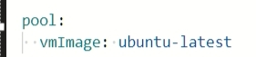

<!--more-->

參考官方教學 - Asp.Net.Core範例，搭配Self-hosted Windows Agent程式(參考3)。

注意事項：
* 需要Azure DevOps，並且已經建立好組織和Project。
  * [Azure DevOps](https://azure.microsoft.com/en-us/services/devops/)
  * [Sign up, sign in to Azure DevOps](https://docs.microsoft.com/en-us/azure/devops/user-guide/sign-up-invite-teammates?view=azure-devops#sign-up-with-a-personal-microsoft-account)
* 需要GitHub帳戶，筆記使用儲存庫來自GitHub。
* Self-hosted windows agent需事前設置好並啟動監聽Job。

---

#### Step 1. 建立Gitub儲存庫

將官方GitHub範例儲存庫Fork至自己Github底下儲存庫，點擊`Fork`按鈕進行複製操作。
* [MicrosoftDocs/pipelines-dotnet-core](https://github.com/MicrosoftDocs/pipelines-dotnet-core)

#### Step 2. 建立Pipeline

選擇使用專案 --> Pipeline頁面點選`New Pipeline`  

儲存庫來源選擇`GitHub`  

選擇已經Fork至自己GitHub儲存庫
* 如果為初次設置情況(GitHub儲存庫從未授權過)
  1. GitHub登入驗證。
  2. 選擇GitHub授權儲存庫來源。
  3. 授權GitHub安裝 Azure Pipelines 應用程式(核准安裝)。

選擇`Asp.Net.Core 管線範本`  

設定預設Yaml內容
* 針對`Pool`區塊內容
  * 如果是使用Azure DevOps Services包裝好VM Image，必須以`vmImage`作為Key來設置。
  * **此筆記需設置使用自訂Agent Pool集區**。
  * 關於自訂Agent Pool集區是在`Organization settings` --> `Agent pools`，列表顯示內容就是集區名稱。
    * Ex：自訂Agent Pool集區名稱為`My Windows Agent` 
      1. 預設Pool設置為`vmImage: ubuntu-latest`更改為自訂Agent Pool集區名稱               
        
      2. 將Pool設置改為使用自訂Agent Pool集區
         
        

#### Step 3. 執行Pipeline

在前一個步驟設定完Yaml內容後，點擊`Save and run`執行，觸發動作如下

1. 將設定好Yaml檔案推送至授權GitHub儲存庫，Yaml檔案名稱為`azure-pipelines.yml`   

2. Self-hosted windows agent 接收到新Job請求，開始執行Yaml內設置Job內容  
     
     
    

---

#### 相關參考
1. [建立您的第一個管線](https://docs.microsoft.com/zh-tw/azure/devops/pipelines/create-first-pipeline?view=azure-devops&tabs=tfs-2018-2%2Cbrowser%2Cjava#create-your-first-pipeline-1)
2. [pipelines-dotnet-core](https://github.com/MicrosoftDocs/pipelines-dotnet-core)
3. [Azure Pipelines 設置Self-hosted Windows代理程式](https://s123600g.github.io/azure%20devops/azure%20pipelines/2022/02/01/Azure-Pipelines-%E8%A8%AD%E7%BD%AESelf-hosted-Windows%E4%BB%A3%E7%90%86%E7%A8%8B%E5%BC%8F.html)

