<!--more-->

此為紀錄筆者在工作上，碰到公司需要建置新的私有本地NPM Server 操作筆記，在Windows 10下使用Verdaccio並搭配Docker來建置環境。

關於Docker安裝過程省略，直接進行Container服務操作。

---

### Verdaccio

##### Step 1. 下載image
```shell
docker pull verdaccio/verdaccio
```
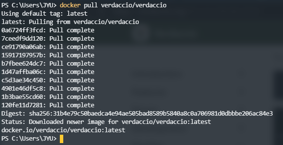

可以透過以下指令查看下載的Image
```shell
docker images
```
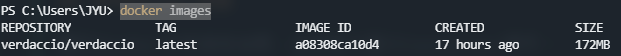

可以看到Image名為`verdaccio/verdaccio`，並且Tag為`latest`，在運行Container指定的images來源正確名稱為`verdaccio/verdaccio:latest`。

##### Step 2. 運行Container

官方預設運行指令
```shell
docker run -it --rm --name verdaccio -p 4873:4873 verdaccio/verdaccio
```
* `-p` 參數設置Host與Container內TCP對應Port，官方預設是以4873來作為兩方對應Port。
* `--rm` 當Container服務退出時，會把Container給清除掉。
* `--it` 當執行運作Container指令時，會把當前終端機與Container做TTY連結，使其變成當前Container程序標準輸出入介面。

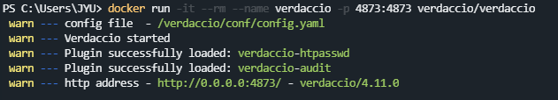

當有在瀏覽器上輸入網址進行瀏覽動作時，可以發現當前運行指令終端機準輸出入介面中，輸出了有瀏覽狀態紀錄。

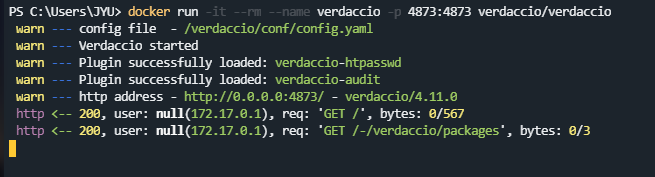

預設執行模式為`Foreground`，當執行完畢後Container服務就結束，因為有加上`--rm`所以會清除掉該Container包含屬於內部相關anonymous volumes。

筆者使用環境當然是需要讓服務常駐在背景運作，也就是在Detached模式運作，需要更改指令參數配置
```powershell
docker run --name verdaccio -p 4873:4873 -v F:\verdaccio\storage:/verdaccio/storage  --restart always -d verdaccio/verdaccio
```
* `-v` 將Container內部VOLUME(`/verdaccio/storage`)與本機指定實體位址做掛載。
* `--restart always` 設置不管在什麼情況下導致Container退出，都強制讓Container服務重新啟動運作。
* `-d` 指定將Container服務常駐運作在背景中。

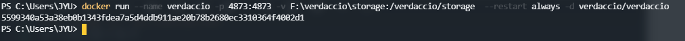

運行下列指令確認Container服務狀態
```powershell
docker ps -a
```

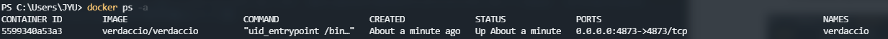

可以觀察到在`STATUS`是`Up About a minute`，代表Container服務正常運作中。

在瀏覽器上輸入`http://127.0.0.1:4873/`進行瀏覽可以看到Server首頁。

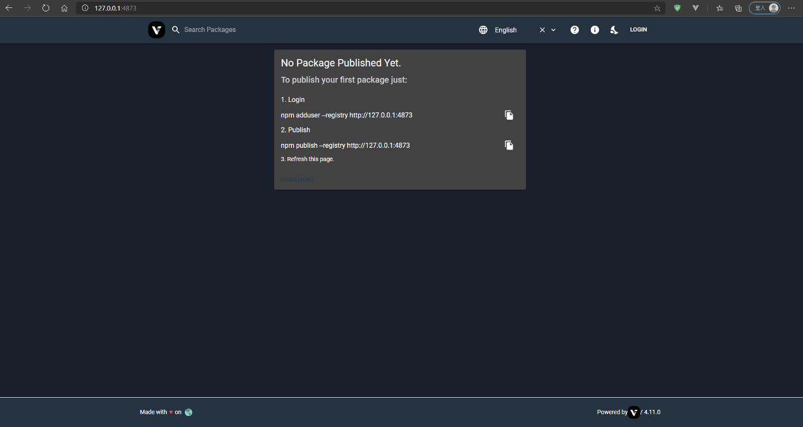

---

### 關於使用到NPM操作指令

##### 建立User
```shell
npm adduser --registry http://127.0.0.1:4873
```

##### 登入User
```shell
npm login --registry http://127.0.0.1:4873
```

##### 登出User
```shell
npm logout --registry http://127.0.0.1:4873
```

##### 查看目前登入者
```shell
npm whoami --registry http://127.0.0.1:4873
```

##### 發佈
```shell
npm publish --registry http://127.0.0.1:4873
```

##### 取消發佈
```shell
npm unpublish PackageName --force --registry http://127.0.0.1:4873
```
參考格式: `npm unpublish [<@scope>/]<pkg> --force`

##### 下載
```shell
npm install PackageName --registry http://127.0.0.1:4873
```

---

### 執行操作範例

##### 準備Sample Package
在自訂位置底下建立一個資料夾名為HelloTest，並在該目錄底下執行下面操作

* Step 1. 建立`package.json`
```shell
npm init
```

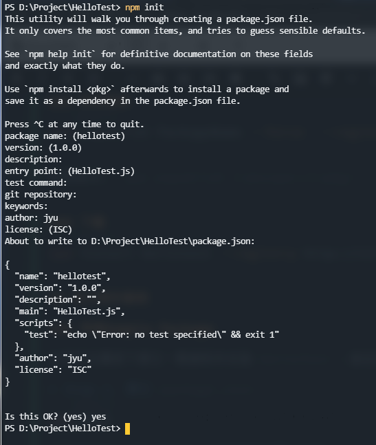

* Step 2. 建立`HelloTest.js`，並貼上以下內容
```javascript
function Helloworld() {   
    console.log("Helloworld"); 
}
module.exports = Helloworld;
```

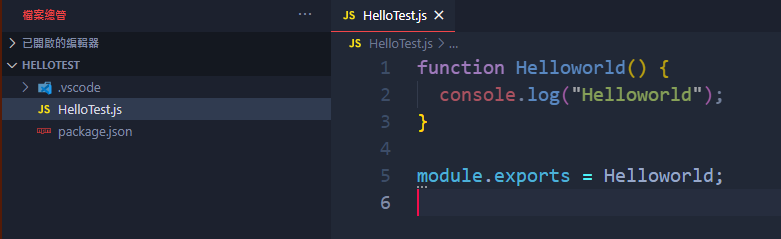

##### 建立User在NPM Server

* Step 1. 先登入User
```shell
npm adduser --registry http://127.0.0.1:4873
```
出現輸入User帳號、密碼與信箱登入，輸入完畢都正確後即登入成功。

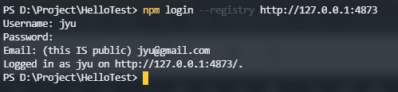

確認目前在NPM Server上登入User身份
```shell
npm whoami --registry http://127.0.0.1:4873
```

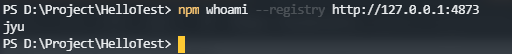

* Step 2. 執行上傳Package
```shell
npm publish --registry http://127.0.0.1:4873
```
**NPM Package** 名稱為當前目錄名稱，在上一個步驟中建立名為HelloTest目錄，並且在裡面建置Package內容檔案。

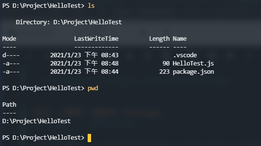

執行上傳完畢後，可以在NPM Server頁面中看到上傳的Package，名稱就如筆者所建立目錄名稱`HelloTest`。

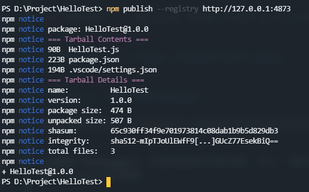


* Step 3. 上傳完畢後登出目前登入使用者
```shell
npm logout --registry http://127.0.0.1:4873
```

##### 下載NPM Package

建立一個放置Package Web目錄。

* Step 1. 下載`hellotest`套件
```shell
npm install hellotest --registry http://127.0.0.1:4873
```

下載完成後，Package會放置在該目錄底下`node_modules/`。

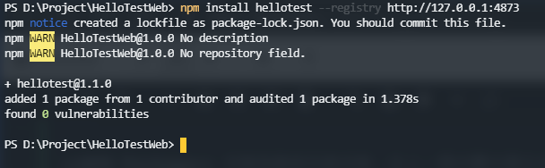


* Step 2. 建立`test.html`
放置以下內容
```javascript
<script src="./node_modules/hellotest/HelloTest.js"></script>  <script type="text/javascript">
   Helloworld(); 
</script>
```

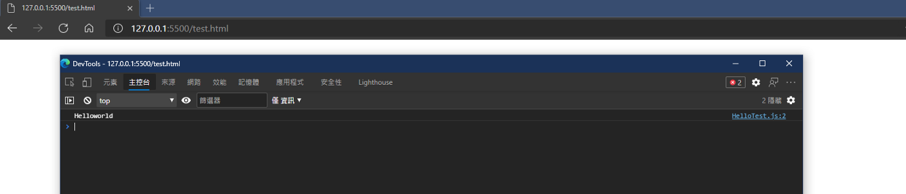

可以看到在上方準備Sample Package步驟中建立測試Function輸出`Helloworld`結果。

##### 取消發佈
```shell
npm unpublish hellotest --force --registry http://127.0.0.1:4873
```

如果想再重新發佈相同套件，須注意在package.json內參數version版本號不能重複存在Server中，需要再重新設定新的版本號，並且在Server上未存在過該版本號紀錄，否則會被Server擋下來並且警告有相同版本號紀錄已存在問題。

---

#### 相關參考
1. [關於Verdaccio](https://github.com/verdaccio/verdaccio)
2. [Docker 安裝Verdaccio官方說明](https://verdaccio.org/docs/en/docker.html)
3. [Verdaccio docker hub](https://hub.docker.com/r/verdaccio/verdaccio)
4. [[筆記] 建立自己的 npm, 以npm Orgs跟Verdaccio為例](https://ceall8650.medium.com/%E7%AD%86%E8%A8%98-%E5%BB%BA%E7%AB%8B%E8%87%AA%E5%B7%B1%E7%9A%84-npm-%E4%BB%A5npm-orgs%E8%B7%9Fverdaccio%E7%82%BA%E4%BE%8B-cfb83b2307e6)
5. [Docker-Foreground](https://docs.docker.com/engine/reference/run/#foreground)
6. [Docker-Clean up (--rm)](https://docs.docker.com/engine/reference/run/#clean-up---rm)
7. [Detached vs foreground](https://docs.docker.com/engine/reference/run/#detached-vs-foreground)
8. [Restart policies (--restart)](https://docs.docker.com/engine/reference/run/#detached-vs-foreground)
9. [docker-hub verdaccio/verdaccio](https://hub.docker.com/r/verdaccio/verdaccio)


