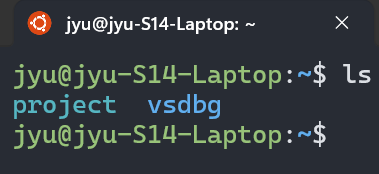
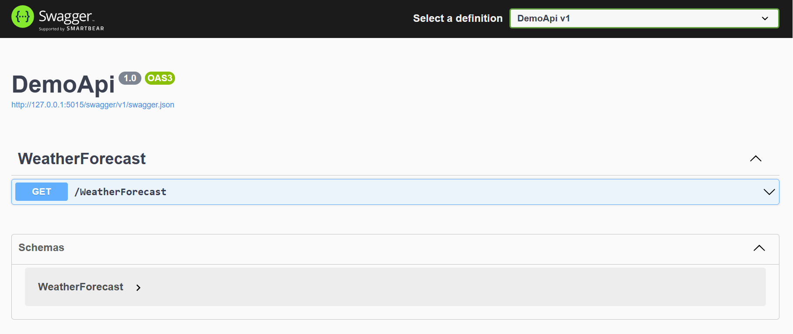
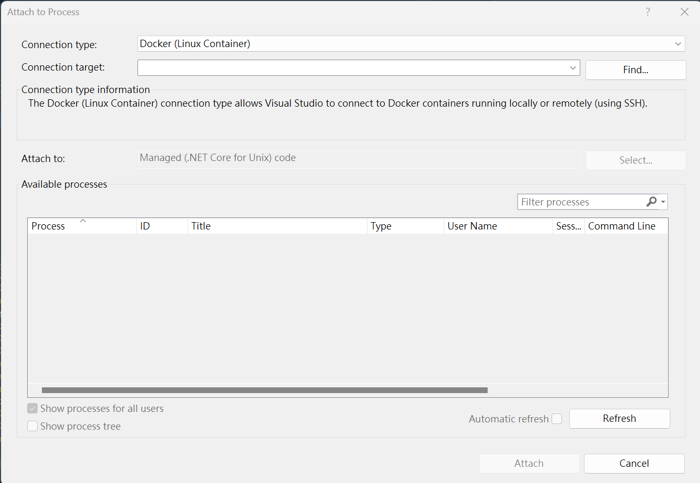
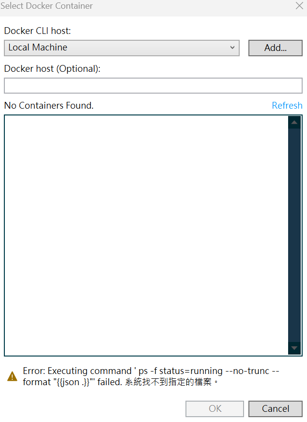
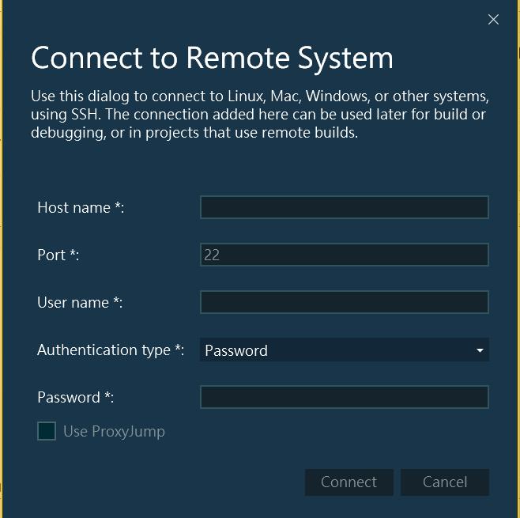
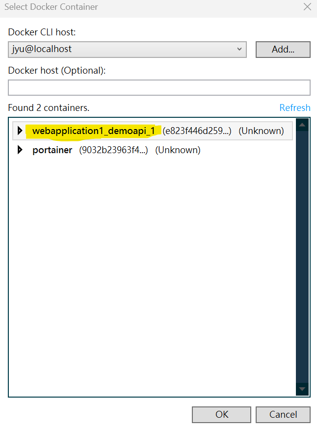

<!--more-->

Windows環境未安裝Docker Desktop，運行`WSL2`+`Ubuntu`子系統有安裝`Docker Enginer`環境下，Visual studio附加串接至容器進行偵錯配置筆記。

如果使用情境比較複雜，此筆記紀錄方法不確定是否可適用，需再自行評估是否還是需要Docker Desktop來輔助。

使用環境：
1. Windows作業系統。
2. WSL2使用Ubuntu 22.04。
3. Visual Studio 2022。
4. Docker Engine，無安裝Docker Desktop。

---

## 事前準備

**Step 1. WSL安裝設置**

使用Winodws內WSL(Windows Subsystem for Linux)功能，使用版本為V2 --> `WSL2`

關於`WSL2`安裝可以參考 [How to install Linux on Windows with WSL](https://learn.microsoft.com/en-us/windows/wsl/install)，安裝過程也會順便創建最新版Ubuntu子系統，後面操作以此Linux環境操作。

> 再此紀錄時間點下，使用Ubuntu最新版本為`Ubuntu Jammy 22.04 (LTS)`

**Step 2. 安裝Docker Engine**

Docker容器是放置在Linux環境下，需要在Ubuntu終端機介面下，進行`Docker Enginer`安裝，可以參考[Install Docker Engine on Ubuntu](https://docs.docker.com/engine/install/ubuntu/)

此筆記是Windows不安裝Docker Desktop，如果Windows要使用Docker容器的話，常見介紹作法是安裝Docker Desktop，可以參考[Install Docker Desktop on Windows](https://docs.docker.com/desktop/install/windows-install/)

因為安裝過程會自動幫你透過WSL建置Docker Enginer相關設定和實體，算是懶人包操作處理，透過Docker Desktop來管理整個Docker Enginer運作。

簡單來說，Windows實際上還是運行Linux環境操作Docker容器(預設使用Linux Container情況)。

**Step 3. 安裝SSH Server**

使用`OpenSSH Server`工具，可以參考[OpenSSH Server](https://ubuntu.com/server/docs/service-openssh)

根據[Attach to a process running on a Docker container - Prerequisites](https://learn.microsoft.com/en-us/visualstudio/debugger/attach-to-process-running-in-docker-container?view=vs-2022#prerequisites)，透過以下指令進行安裝`openssh-server`
```shell
sudo apt-get install openssh-server unzip curl
```

確認SSH Server服務狀態
```shell
sudo service ssh status
```

安裝完之後，SSH Server服務是未啟動狀態，需再手動將其服務啟動
```shell
sudo service ssh start
```

Windows環境測試SSH連接
```shell
ssh <username>@<ip-address>
```
* `<username>` --> WSL下Ubuntu的User Name
* `<ip-address>` --> WSL下Ubuntu的IP，使用127.0.0.1即可

EX：`<username>` = test01
```shell
ssh test01@127.0.0.1
```

當終端機顯示以下訊息，請輸入`yes`按下Enter送出
```
Are you sure you want to continue connecting (yes/no/[fingerprint])?
```

之後會出現輸入登入密碼，輸入成功後即可成功連到SSH Server。

**Step 4. 掛載專案存放位置**

WSL底下Ubuntu預設使用者目錄內沒有對應Windows本機上專案存放目錄，可以將Windows存放專案目錄做一個軟連結(link)。

WSL底下Ubuntu預設有跟Windows本機檔案目錄做一個掛載地方-->`/mnt`，如果用`ls`顯示該目錄底下內容，可以看到以Windows上磁碟曹代號目錄。

假設Windows上存放專案目錄在`C:\Project`，對應`/mnt/c/project`，依據此位置在使用者根目錄(`~`)下建軟連結目錄。
```shell
ln -s /mnt/c/project /home/jyu
```
> 將`/mnt/c/project`建立軟連結在使用者目錄底下-->`/home/jyu`

透過`ls`查看根目錄(`~`)底下內容，可以發現多了一個`project`名稱目錄。



---

## 執行偵錯

使用Visual Studio建立預設API專案作為範例。

專案需要有docker相關運作配置，可以參考[Adding Docker support](https://learn.microsoft.com/en-us/visualstudio/containers/overview?view=vs-2022#adding-docker-support)

#### 運行Container

以docker-compose做範例，docker-compose相關yaml配置檔在WSL內Ubuntu底下位置-->`~/project/Local/WebApplication1`。

以下指令皆在WSL內Ubuntu終端機介面執行。

切換至專案目錄底下
```shell
cd ~/project/Local/WebApplication1
```

> `~`代表在當前使用者家目錄。
> 範例專案名稱為WebApplication1。

執行運作
```shell
docker-compose -f docker-compose.yml -f docker-compose.override.yml  up -d
```

> `-f` 代表要引用的yaml配置檔案。
> `-d` 代表運作起來在背景常駐執行，當前終端機不持續追蹤運行容器程序之中。

範例API專案預設配置Port為`5015`(不一定都是)，開啟Swagger介面位址-->`http://127.0.0.1:5015/swagger/index.html`



#### 連接Container偵錯

開始偵錯前需要確認以下事項
1. WSL底下Ubuntu內SSH Server服務是啟用正常運作中。
2. 專案Container是否有運作起來。

**Step 1. Visual Studio內點擊`Debug`-->`Attach to Process`**



> Connection Type 選擇`Docker(Linux Container)`

**Step 2. 點擊Connection target旁邊`Find`按鈕**



點選`Add`按鈕，出現登入SSH介面



> Host Name輸入`localhost`，因為是在本機內WSL底下Ubuntu。
> Port使用SSH預設`22`。
> Authentication type選擇`Password`。
> User Name和Password輸入WSL底下Ubuntu使用者帳戶登入名稱和密碼。

點擊`Connect`正常連到之後，可以看到WSL內Ubuntu底下運行Container清單，找到範例專案`webapplication1_demoapi_1`並選取按`OK`。



之後回到`Attach to Process`介面，可以看到被選取的容器專案，按下`Attach`後Visual Studio即會開始進行連結偵錯。

找到範例API下中斷點，回到Swagger介面測試該API呼叫，可以發現中斷點可執行運作。


如果更改程式還需要在重新連結偵錯，需要把Conatiner刪除重新在建置運行一次，Visual Studio需要再透過`Attach to Process`操作來執行。

---

#### 相關參考
1. [How to use Visual Studio without Docker Desktop to debug a .NET Core application running in a container inside WSL](https://dotnetting.net/2022/01/how-to-use-visual-studio-without-docker-desktop-to-debug-a-.net-core-application-running-in-a-container-inside-wsl/)
2. [附加至於 Linux Docker 容器執行的處理序](https://learn.microsoft.com/zh-tw/visualstudio/debugger/attach-to-process-running-in-docker-container?view=vs-2022#attach-to-a-process-running-on-a-linux-docker-container)
3. [How do I mount a folder from another partition?](https://askubuntu.com/questions/205841/how-do-i-mount-a-folder-from-another-partition)
