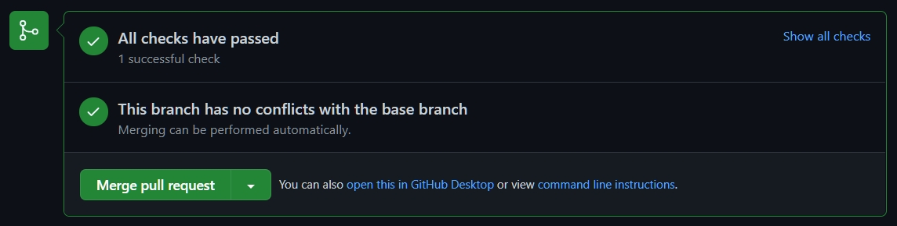

此筆記紀錄筆者Blog網站，使用GitHub Action配置自動佈版程序。

<!--more-->

文章內以下單詞語會以簡稱代替
* `pull_request` --> PR
* `GitHub Action` --> Action

---

# 儲存庫內部佈版規劃

儲存庫最重要分支分別為
* `main` 
  - 主分支用來作為網站程式Base底層。
* `gh-pages` 
  - 依據`main`分支作為佈版來源套用至此分支，Blog呈現來源是以此分支為基礎呈現。

Blog更新規劃步驟如下
* Step 1. 建立分支並將更動內容**Push**上去。
* Step 2. 建立**PR**，確認Action內PR Build程序都成功。
* Step 3. 確認PR更動內容進行merge到`main`，**PR**狀態切為`closed`，由Action進行佈版程序。

---

# 內部設定

### GitHub Token
* 登入GitHub
* [GitHub Profile -> Developer settings -> Personal access tokens](https://github.com/settings/tokens)
  - 點選`Generate new token`
  
  - `Note` 設定此Token名稱，自己命名可識別名稱。
  - `Expiration` 設定Token 效期
    - 如果要一直使用請設定 `No expiration`
  - `Select scopes` 設定此Token權限
    - **Public**儲存庫只需要repo區塊裡面三個權限，`repo:status`、`repo_deployment`、`public_repo`
    
    - **Private**儲存庫，需要勾`repo`  
    
    - 其餘權限如有需要再自行開啟。
  - 設定`Repository Secret`
    - 在目標儲存庫Settings -> secrets 建立名為`GITHUBTOKEN` secret，並將前面建好GitHub Token設置到此secret。
     

### 確認Gemfile配置
設定好用到的額外套件配置，在跑Action時，建置環境時會依據此檔案配置安裝所需套件。

### 建立**PR**事件Action程序

Yaml配置檔： [github-pr_build.yml](https://github.com/s123600g/s123600g.github.io/blob/main/.github/workflows/github-pr_build.yml)

觸發此Action程序時機為**PR-opened**、**PR-reopened**，在Check Status區塊可以看到目前Action程序執行狀態。

Yaml配置檔對應為`on`區塊
```yaml
on:
  pull_request:
    types: [opened, reopened]
```
* `types` 可設定指定**PR**內事件進行觸發。

詳細可以參考
[https://docs.github.com/en/actions/learn-github-actions/events-that-trigger-workflows#pull_request](https://docs.github.com/en/actions/learn-github-actions/events-that-trigger-workflows#pull_request)

設定只進行Build程序，而不進行佈版，Yaml配置檔對應`with`區塊，內部參數
* `token` 對應前面設定GitHub Token環節，最後建立`Repository Secret` - `GITHUBTOKEN`。
* `build_only` 設置為`true`只進行Build程序，不進行佈版處理。

詳細可以參考
[https://github.com/marketplace/actions/jekyll-actions#inputs](https://github.com/marketplace/actions/jekyll-actions#inputs)

### 建立**PR-closed**事件Action程序

Yaml配置檔： [github-deployment.yml](https://github.com/s123600g/s123600g.github.io/blob/main/.github/workflows/github-deployment.yml)

觸發此Action程序時機為**PR-closed**，在Check Status區塊可以看到目前Action程序執行狀態。

Yaml配置檔對應為`on`區塊
```yaml
on:
  pull_request:
    types: [closed]
```
* `types` 可設定指定**PR**內事件進行觸發。

設定進行Build與佈版程序，和前面建立**PR**事件Action程序差別在於`with`區塊參數配置，`build_only`並未設置，只設置以下參數

* `target_branch` 指定佈版目標分支，在這設定為`gh-pages`。

### 執行測試

將設定好Yaml檔案在`main`分支Push上去，在建立自訂分支，依據以下步驟測試執行
* 建立一個Commit並透過自訂分支Push上去
  - 回到儲存庫Actions確認由**push**事件做Build Jekyll site 是否成功執行完畢。
* 在自訂分支建立一個**PR**
  - 在儲存庫pull_request確認由**PR**事件Action程序是否成功執行完畢。
  
  - Done <br/>
  
* 將**PR**確認進行merge程序
  - 確認pull_request merge 程序完成並已closed。
  
  - 回到儲存庫Actions確認由**PR-closed**事件Action程序是否成功執行完畢。
  
  - 如果成功執行完畢，在儲存庫分支會多一個`gh-pages`，此為佈版目標分支。

---

#### 相關參考

* [Jekyll Actions](https://github.com/marketplace/actions/jekyll-actions)
* [GitHub Actions](https://docs.github.com/en/actions)
* [GitHub Actions Workflow-Syntax](https://docs.github.com/en/actions/learn-github-actions/workflow-syntax-for-github-actions#onpushpull_requestbranchestags)
* [Events that trigger workflows](https://docs.github.com/en/actions/learn-github-actions/events-that-trigger-workflows)
* [github action + jekyll](https://blog.awesome-doge.org/githubaction+jekyll/)

