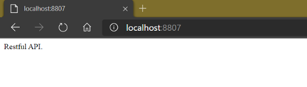
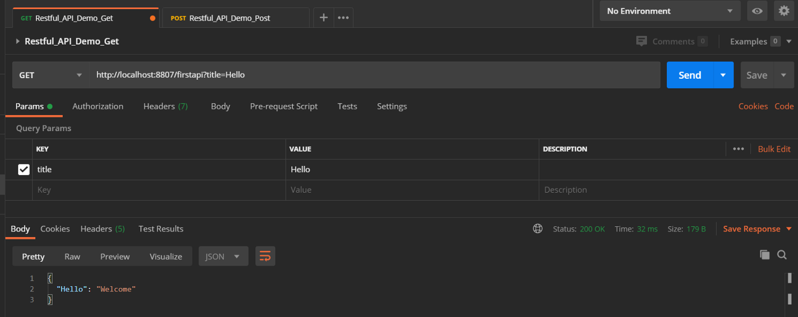
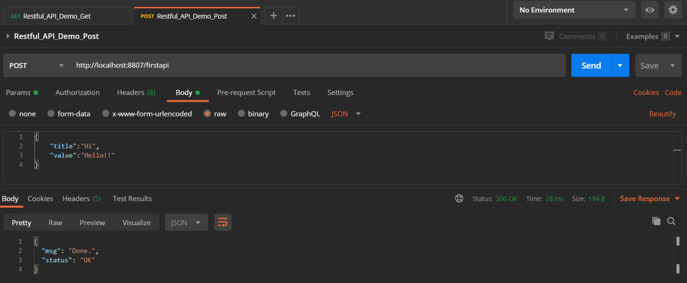

<!--more-->

---

## 下載專案包

[https://github.com/s123600g/FlaskDemoNotes/tree/master/Restful_API](https://github.com/s123600g/FlaskDemoNotes/tree/master/Restful_API)

建立完成後請記得在專案目錄內新增一個uwsgi目錄，此為用來放置uWSGI運行Log檔案。

---

## 下載Dockfile與建置Image

[https://github.com/s123600g/FlaskDemoNotes/tree/master/Docker/Nginx_uWSGI_RestfulAPI](https://github.com/s123600g/FlaskDemoNotes/tree/master/Docker/Nginx_uWSGI_RestfulAPI)

預設服務使用的Port為8807，如果需要更改請修改Dockerfile內

```yaml
ENV web_port=8807
```

在終端機記得先切換位置至Dockerfle所在位置內，切換完後再建置Image
```shell
docker build -t nginx_flask_restfulapi_server:p8807 .
```

如果要修改Image所顯示名稱與標籤，修改`-t`後面參數內容 --> `nginx_flask_restfulapi_server:p8807`

---

## 運行Docker容器服務

在終端機使用`docker run`指令建置容器服務運行
```shell
docker run  --name flask_restfulapi_base -p 8807:80 -v E:\Project\GitHub\FlaskDemoNotes\Restful_API:/web/web_data -d nginx_flask_restfulapi_server:p8807
```

記得要修改`-v`後面參數內容 --> `E:\Project\GitHub\FlaskDemoNotes\Restful_API` 改成自己對應位置。

如果有修改Dockerfile內預設服務使用的Port，請將`-p`後面參數內容`8807`改成自己設定的Port。


#### 測試容器服務是否正常運作起來

在瀏覽器輸入以下位址
```
http://localhost:8807/
```



這裡預設是顯示在`Server.py`內針對`/`路由位置內配置
```python
@app.route("/", methods=['GET'])
def index():   
    return "Restful API."
```


主要用來測試容器服務掛載運作是否有起來，實際上主要API設置是在`Restful_API/FirstAPI.py`，詳細可參考下方框架配置說明。

#### 使用Postman測試 GET與POST

**GET**
```
http://localhost:8807/firstapi?title=Hello
```



**POST**
```
http://localhost:8807/firstapi
```

body參數
```json
{
    "title":"Hi",
    "value":"Hello!!"
}
```



---

## 框架配置說明

API主體參數與實體配置檔案為`Startup.py`

API模組放在`Restful_API/`內 → `FirstAPI.py`

官方 Quickstart：
[https://flask-restful.readthedocs.io/en/latest/quickstart.html](https://flask-restful.readthedocs.io/en/latest/quickstart.html)


### 在Startup.py設置

1. 初始化 Flask Restful API 實體

```python
api = Api(app)
```

先建立Flask-RESTful API本體，之後所有API類別都會註冊給此本體作控管。

2. 匯入 Restful API Module

```python
from Restful_API.FirstAPI import FirstAPI
```

將獨立API類別做為一個模組，可以自己自訂那些API負責做什麼事情。

3. 註冊 Restful API Module for Router

```python
api.add_resource(FirstAPI, '/firstapi',methods=['GET','POST'])
```

將客製好的API模組給予註冊一個路由分配，透過指定路由來讓本體知道來自這一支路由請求該去哪一個模組處理請求。


### 在FirstAPI.py設置

在實作一個API模組時，需要先匯入重要相關套件Resource

```python
from flask_restful import Resource
```

flask_restful Resource是我們實作模組基礎，也就是我們API類別繼承上層父類別，這一個最上層父類別幫我們實作了一些HTTP Method View基底，所以我們在模組繼承此類別後，可以直接實作針對Http Method View Function，在這Function名稱就是以使用Http Method來命名。

```
class API_Module_Name(Resource):
    
    # Http Method View Function
    def your_Http_Method_Name(self):
        pass
```

關於可使用Http Method View可參考： [Method Views for APIs​](https://flask.palletsprojects.com/en/1.1.x/views/#method-views-for-apis)

在官方說明中你可以看到提供簡單實作例子：
[https://flask-restful.readthedocs.io/en/latest/quickstart.html#a-minimal-api](https://flask-restful.readthedocs.io/en/latest/quickstart.html#a-minimal-api)

在此API模組例子中，首先第一步先將模組類別繼承Resource

```python
class FirstAPI(Resource):
```

內部簡單實作一個dict_result Dict物件作為簡單暫存空間，內部遵循以下資料結構

```json
{ key:value }
```

實際建置

```python
dict_result = {
    "Hello":"Welcome",
    "Author":"jyu"
}
```

在完成繼承後，以此上層類別基礎實作兩種Http Method View Function，分別是GET與POST。

**Http Method View Functionv --> GET**

<script src="https://gist.github.com/s123600g/bf79a8ebb67ed6cb6b51d79e031739e6.js"></script>

根據URL參數所傳遞參數title內容值作為dict_result簡單暫存空間取值依據，取出值後回傳給請求端作為回應結果。

取出URL參數 — title

```python
get_web_arg_title = str(request.args.get("title"))
```

關鍵點在於request來自於

```python
from flask import request
```

使用

```python
request.args.get()
```

可參考 The Request Context：<br/>
[https://flask.palletsprojects.com/en/1.1.x/reqcontext/](https://flask.palletsprojects.com/en/1.1.x/reqcontext/)


**Http Method View Functionv — POST**

<script src="https://gist.github.com/s123600g/54ae65096331b55dde243c631e3e9d69.js"></script>

根據POST請求帶資料FormBody → JSON內title與value各自對應value，來新增一筆資料紀錄在dict_result簡單暫存空間。

取出JSON資料 — title、value

```python
data = request.get_json(force=True)
get_web_arg_title = str(data["title"])
get_web_arg_value = str(data["value"])
```

關鍵點在於request來自於

```python
from flask import request
```

使用

```python
request.get_json()
```

可參考 Incoming Request Data — get_json： <br/>

[https://flask.palletsprojects.com/en/1.1.x/api/#flask.Request.get_json](https://flask.palletsprojects.com/en/1.1.x/api/#flask.Request.get_json)

