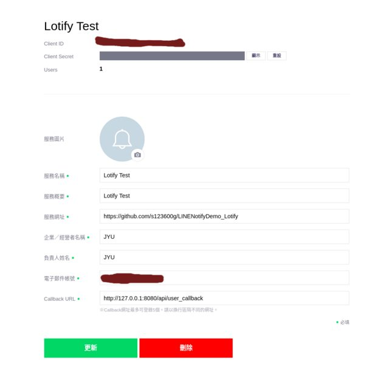
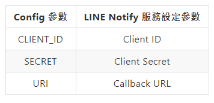
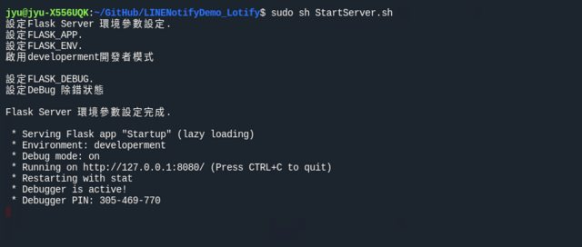
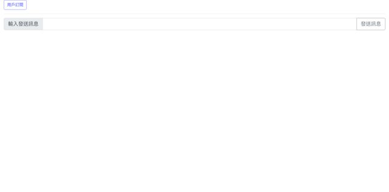
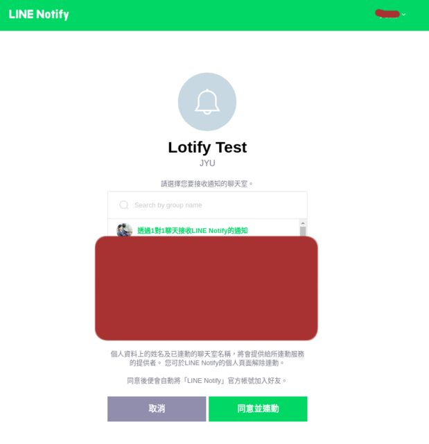
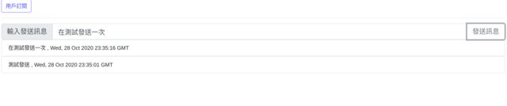
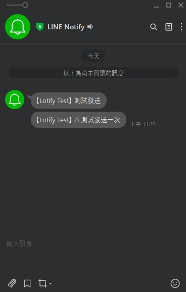

<!--more-->

## 前言

參加今年MOPCON 2020 剛好聽到LINE自家工程師演講開發Python套件Lotify，此套件已經整合LINE API呼叫操作部份， 來試試看發送基本文字訊息與訂閱基本實作。

此筆記範例 GitHub: [https://github.com/s123600g/LINENotifyDemo_Lotify](https://github.com/s123600g/LINENotifyDemo_Lotify)

---

## 環境建置

使用Flask做一個簡單網站框架，搭配[Vue3](https://vuejs.org/)來做一個簡單資料操作(這只是作者個人自己還在學習Vue，套入簡單練習應用)，在Ubuntu 20.04環境下實作。

#### 第一步 安裝Python 套件
```shell
pip3 install -r requirements.txt
```

因應Flask框架設置，所有靜態檔案預設都放置在static/底下，其實是對應在Config.py內設置

```python
static_folder = 'static'
```

設置一個指定放置靜態檔案目錄名稱，也就是`static/`

#### 第二步 下載NPM Package

package.json在專案目錄內static底下
```shell
npm i
```

前面說到所有靜態檔案都在static底下，所以package.json也會在裡面，必須要先在終端機切換位置至static/，在做上面指令進行Package檔案下載補齊，完成後就會在static底下產生一個node_modules目錄。


#### 第三步 設定LINE Notify個人服務

要前往[LINE Notify](https://notify-bot.line.me/zh_TW/)進行服務建立，進去後需要登入個人的LINE帳號，然後建立起服務設置大概如下



其中需要注意的是**Callback URL**這個項目，它會跟用戶訂閱動作有相關，在用戶訂閱完成後，LINE Notify會根據這個項目設定的網址進行導向，而我們需要透過這個網址去接收LINE Notify所回傳的用戶訂閱授權token，也就是說我們提供一個管道讓LINE Notify去將頁面導向，同一時間導向完畢後面就由我們這邊接手處理後面事情，在這範例中設置了 **/api/user_callback** 連結，進行接收授權token後再自動導向到首頁去。

<script src="https://gist.github.com/s123600g/bbcb0379a72a51f7f383d54817278783.js"></script>

在導向回來過程URL為，**http://127.0.0.1:8080/api/user_callback?code=**，用戶授權token會放在url參數code，將其取回後再放入SQLite DB存放，完成後再透過redirect導向回去首頁。


#### 第四步 設定Client ID、Client Secret、Redirect_uri

這部份在Config.py內設置
```python
CLIENT_ID = "Vf.........................v"
SECRET = "0l.............................N6"
URI = "http://127.0.0.1:8080/api/user_callback"
```




#### 啟動測試伺服器

```shell
sudo sh StartServer.sh
```




在網址列輸入 `http://127.0.0.1:8080/`即可看到下面畫面



#### 用戶訂閱




#### 發送訊息給用戶






發送訊息功能不單單只有基本文字訊息，還可以傳圖片(檔案、圖片連結)、貼圖，有興趣讀者可以去看看Lotify了解。


---

#### 相關參考

1. [lotify](https://github.com/louis70109/lotify)
2. [LINE Notify API Document](https://notify-bot.line.me/doc/en/)
3. [LINE Notify](https://notify-bot.line.me/zh_TW/)
4. [Flask](https://flask.palletsprojects.com/en/1.1.x/)
5. [flask-script](https://flask-script.readthedocs.io/en/latest/)

