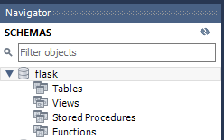
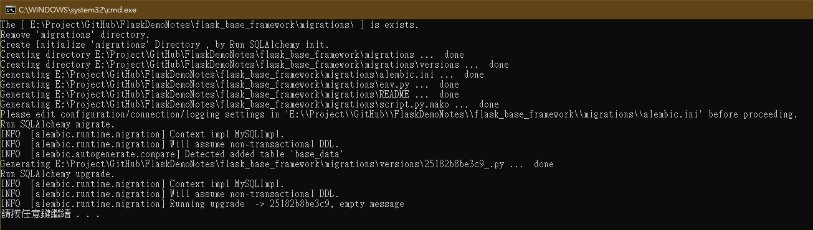
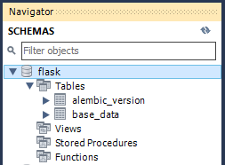
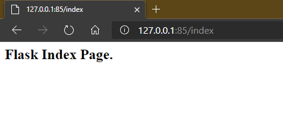

<!--more-->

GitHub: [https://github.com/s123600g/FlaskDemoNotes/](https://github.com/s123600g/FlaskDemoNotes/)

在Flask網站基礎框架上預設會有以下結構:

```
.
├── BaseData
│   ├── BaseData.py
│   ├── __init__.py
│   
├── Config.py
├── DB_initialize.bat
├── DB_initialize.sh
├── Manage.py
├── Server.py
├── Startup.py
├── migrations
│   ├── README
│   ├── __pycache__
│   │   └── env.cpython-36.pyc
│   ├── alembic.ini
│   ├── env.py
│   ├── script.py.mako
│   └── versions
│       ├── 8c1ac1a960d2_.py
│       └── __pycache__
│           └── 8c1ac1a960d2_.cpython-36.pyc
├── static
│   ├── css
│   │   └── base.css
│   └── js
│       └── base.js
├── templates
│   └── index.html
├── uwsgi
│   └── uwsgi.log
└── uwsgi.ini
```
* Config.py --> 網站整體參數配置
* Startup.py --> 啟動初始化
* Server.py --> 路由與動作控制中心
* BaseData --> 資料模型
* Manage.py --> 執行命令控管
* uwsgi.ini --> uWSGi配置檔
* static/ --> 靜態檔案目錄
* templates/ --> HTML與模板目錄
* DB_initialize.bat、DB_initialize.sh --> 資料模型更新腳本

---

# 快速使用建置

### Step 1.下載好專案包，放置在自己指定位置。

[https://github.com/s123600g/FlaskDemoNotes/tree/master/flask_base_framework](https://github.com/s123600g/FlaskDemoNotes/tree/master/flask_base_framework)
建立完成後請記得在專案目錄內新增一個uwsgi目錄。

### Step 2.建立好Docker 映像檔。

關於容器建置使用映像檔可參考


### Step 3.資料模型初始化

資料模型實體檔放置在 **baseData/** 底下，實體檔為 `BaseData.py`。

範例資料庫使用MySQL，在進行資料模型初始化之前必須要先完成

- 建立資料庫 --> ```flask```
- 建立使用者 --> ```myflask / myflask``` (user / password)
- 設定使用者與資料庫之間權限

Config.py內設定好資料庫連接參數
<script src="https://gist.github.com/s123600g/23a7d1cada9cd1111ae906270e224057.js"></script>

db_host為資料庫連接位址，因筆者使用Docker MySQL，在連接port上設置會跟預設3306不一樣。

關於Docker MySQL可參考 [https://hub.docker.com/_/mysql](https://hub.docker.com/_/mysql)

將```DB_initialize.bat```內部參數 **DirPath** 
``` bat
Set DirPath=E:\Project\GitHub\FlaskDemoNotes\flask_base_framework\
```
更改為專案放置位置資訊，在點擊執行即可。

執行前:



執行中:



執行後:




### Step 4.運行Docker 容器服務。
關於建立容器服務可參考

```powershell
docker run  --name flask_base_framework -p 85:80 -v E:\Project\GitHub\FlaskDemoNotes\flask_base_framework:/web/web_data -d nginx_flask_server
```

將參數 -v 內
```
E:\Project\GitHub\FlaskDemoNotes\flask_base_framework
```
換成讀者自己放置的位置即可。

### Step 5.容器服務執行後在瀏覽器輸入 http://127.0.0.1:85/index



---

# 配置說明

### Config.py 網站整體參數配置

重要整體參數配置都會設置在此檔案內，有運作模式、網站模板與靜態檔案目錄、資料庫連接字串、使用者自訂參數…等等。

配置檔內容需要包含下面三個重要類別:
1. BaseConfig
2. DevelopermentConfig
3. ProductionConfig

除了上面三個重要類別之外，其餘開發者也可以在自行增加配置參數區塊。

### BaseConfig類別內部配置

靜態目錄與模板目錄位置
```python
static_url_path = '/static'
static_folder = 'static'
template_folder = 'templates'
```

### 資料庫連接配置語法參數

相關參考:
* [Flask-SQLAlchemy](https://flask-sqlalchemy.palletsprojects.com/en/2.x/)
* [Flask-SQLAlchemy Configuration](https://flask-sqlalchemy.palletsprojects.com/en/2.x/config/)
* [Flask-SQLAlchemy Connection URI Format](https://flask-sqlalchemy.palletsprojects.com/en/2.x/config/#connection-uri-format)
* [SQLAlchemy ORM Object Relational Tutorial](https://docs.sqlalchemy.org/en/13/orm/tutorial.html)

資料庫連接語法以MySQL為例
<script src="https://gist.github.com/s123600g/b35395880e354192235040d58b51e1a1.js"></script>

### DevelopermentConfig、ProductionConfig類別內部配置

兩者類別是管理網站運作時，運行模式為開發或正式環境，Session Data加密金鑰設置。

各自都繼承上面BaseConfig類別，在網站啟動時選擇哪一種模式運行時，會自動加載我們在BaseConfig類別中基本設置。

<script src="https://gist.github.com/s123600g/ab0a6c46bc9227b5fbd61c4333dcc7de.js"></script>

### DevelopermentConfig、ProductionConfig模式選擇項目清單

這是給網站主體控制中心在初始化啟動時，選擇運作模式來源開關。
```python
config = {

    'developermentConfig': DevelopermentConfig,
    'productionConfig': ProductionConfig,
    'run_mode_dev':True
}
```
**run_mode_dev** 管控網站運作是否為開發模式，用在Flask初始化載入封裝模式選擇。

### Startup.py 啟動初始化

Startup.py為網站剛開始啟動時，會先初始化必要運作模組與參數配置載入，例如以下模組
* Flask
* Flask-SQLALchemy
* Flask Restful-API
* Flask-Admin
* Flask-Login
* Flask-CSRF

都會在此做載入初始化本體動作，後面其他自訂模組要運用時，只要從Startup匯入該模組變數即可。
```python
from Startup import app
```

### Flask主體初始載入

建置一個app，後面許多控制模組都會用到此變數。
```python
app = Flask(__name__)
```

載入網站運作模式(**developermentConfig** / **productionConfig**)
<script src="https://gist.github.com/s123600g/c964c5a595ec0502573ea52129e425a1.js"></script>


### Flask-SQLALchemy資料模組初始載入 

建置一個**db**，後面許多控制模組如果要調用資料庫都會用到此變數，在資料模型建立資料表時，也會用到此變數。
```python
db = SQLAlchemy(app)
```

註冊資料模型
```python
from BaseData.BaseData import Base_Data
```

如果要建立一個新的資料表時，透過在BaseData內建立好該資料表模型檔後，記得要來此註冊該模型這樣才會被建立起來，如果忘記這一步資料控制模組不會知道有新增一筆資料表模型，自然就不會在資料庫中建立該資料表。


### Server.py路由與動作控制中心

`Server.py`為網站運作主要程式，包含了頁面控制項與路由導向處理。


---
