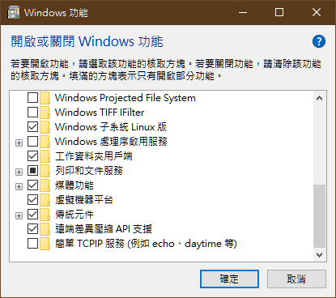
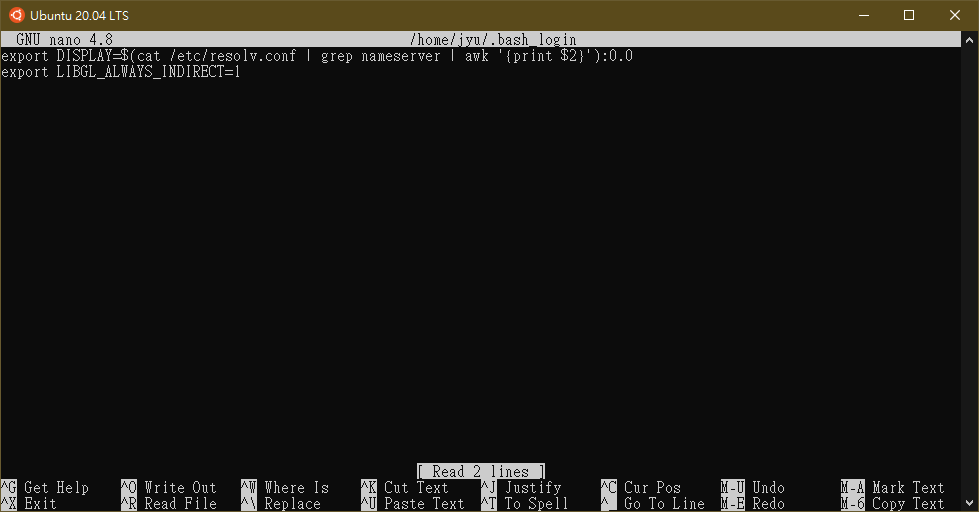
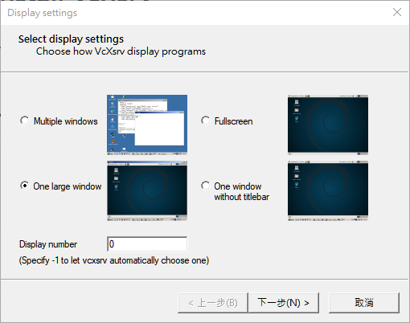
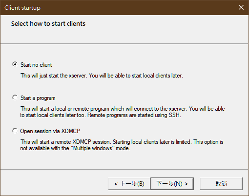
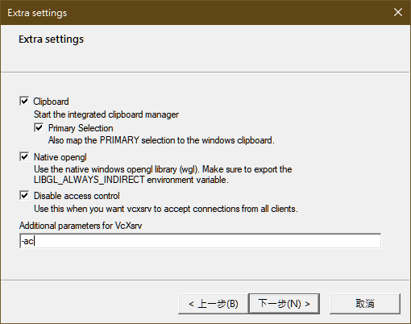
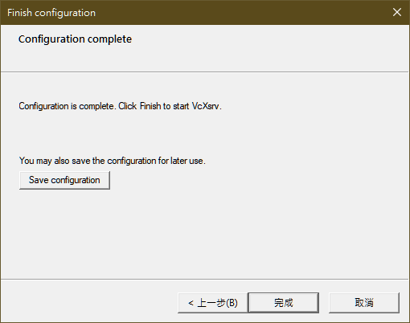
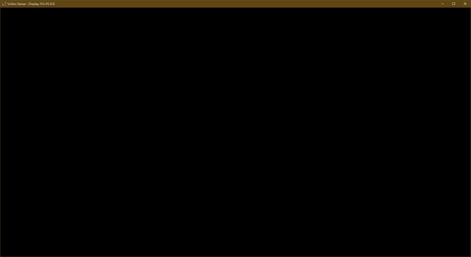
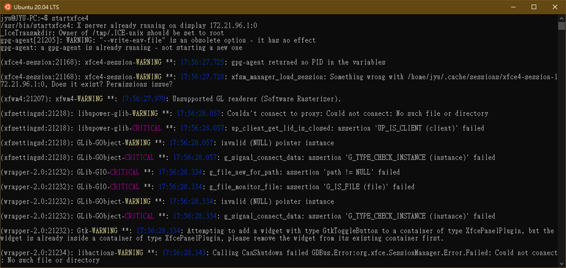
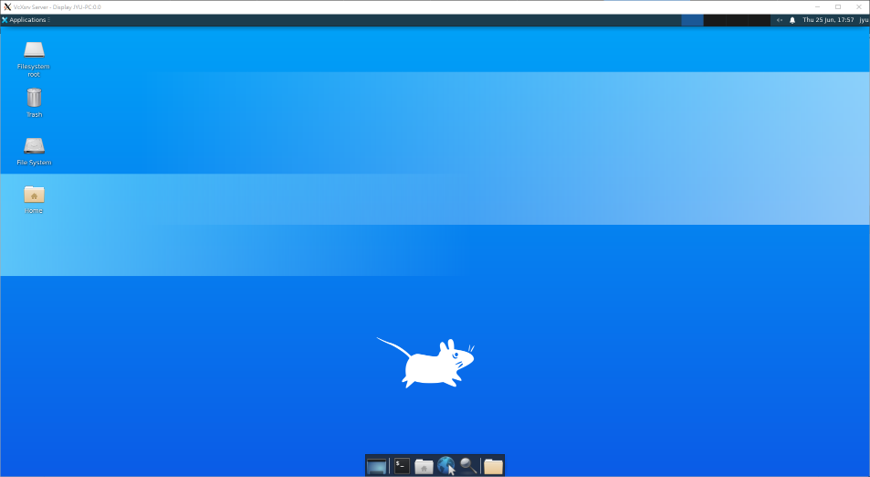
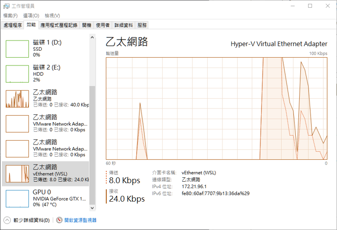

此筆記內容為紀錄筆者在建置WSL2過程中操作與問題。

<!--more-->

關於 Windows 子系統 Linux 版 [https://docs.microsoft.com/zh-tw/windows/wsl/about](https://docs.microsoft.com/zh-tw/windows/wsl/about)

要使用WSL2必須先符合以下條件

* Windows 版本為 2004，組建為19041版本或更高。
* 開啟 Windows子系統Linux版 與 虛擬機器平台。

官方安裝指南
[https://docs.microsoft.com/zh-tw/windows/wsl/install-win10](https://docs.microsoft.com/zh-tw/windows/wsl/install-win10)

---

## Window10 建置Ubuntu(WSL2)

### Step 1.
設定使用WSL2為預設使用版本
```shell
wsl --set-default-version 2
```

### Step 2.

需要去控制台—>程式和功能—>開啟或關Windows功能->勾選`Windows子系統Linux版與虛擬機器平台`



開啟完畢後會跑更新，跑完更新之後會需要重開電腦。

### Step 3.

下載X server連線工具，使用`VcXsrv` <br/>
[https://sourceforge.net/projects/vcxsrv/](https://sourceforge.net/projects/vcxsrv/) <br/>
下載完畢後執行程式安裝完即可。

---

## GUI桌面配置

開啟Ubuntu 20.04 LTS終端機

### Step 1.

執行安裝 X Server 套件
```shell
sudo apt-get install x11-apps
```

### Step 2.

在家目錄(~/)底下建立一個.bash_login
```shell
nano ~/.bash_login
```

並輸入以下內容
<script src="https://gist.github.com/s123600g/a9d262cd95ff6c6fbab339700e8047c8.js"></script>



按Ctrl+x後再按Y最後在按Enter儲存。

### Step 3.

執行安裝 xfce4 桌面
```shell
sudo apt-get install xfce4-terminal
sudo apt-get install xfce4
```

### Step 4.

回到Windows開啟VcXsrv主程式(XLaunch)



Display number 記得設置為0







點選完成，出現下面視窗畫面即可



### Step 5.

在Ubuntu 20.04 LTS終端機啟動X Server，輸入下面指令
```shell
startxfce4
```





---

## 採雷筆記

剛開始建立好啟動X Server時，並沒有預期那麼順利運作起來，碰到X Server運作不起來顯示下面訊息
```
Can't connect to display 172.21.96.1:0
```

172.21.96.1是我的WSL區網虛擬主幹，可以在工作管理員看到



在筆者Ubuntu 20.04 LTS所取得IP是在屬於此虛擬區網主幹內，此主幹在防火牆預設使用防護規則屬於**公用網路**，筆者在執行VcXsrv過程中彈出的防火牆允許視窗中，只勾選了允許私人網路而沒勾到公用網路，摸索研究半天才發現這個問題。

解決方式為去防火牆更設定**允許應用程式或功能通過Windows Defender防火牆**設定中，
將 **VcXsrv windows xserver** 在公用項目打勾即可。


---

#### 相關參考

1. 關於WSL(Windows Subsystem for Linux)說明可參考
   * [https://wiki.ubuntu.com/WSL](https://wiki.ubuntu.com/WSL)
   * [https://docs.microsoft.com/en-us/windows/wsl/install-win10](https://docs.microsoft.com/en-us/windows/wsl/install-win10)
   * [https://docs.microsoft.com/zh-tw/windows/wsl/install-win10](https://docs.microsoft.com/zh-tw/windows/wsl/install-win10)
2. 其他
   * [https://github.com/microsoft/WSL/issues/4106](https://github.com/microsoft/WSL/issues/4106)
   * [https://hackmd.io/@billsun/SyL3pzzQm?type=view](https://hackmd.io/@billsun/SyL3pzzQm?type=view)
   * [https://github.com/QMonkey/wsl-tutorial/blob/master/README.wsl2.md](https://github.com/QMonkey/wsl-tutorial/blob/master/README.wsl2.md)
   * [https://www.youtube.com/watch?v=6_mbd1hvUnE](https://www.youtube.com/watch?v=6_mbd1hvUnE)
