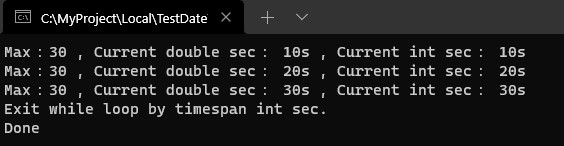
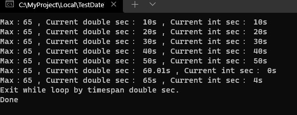

紀錄筆者在工作上遇到計算時間秒數差比對問題。

<!--more-->

工作上剛好協助檢視發送請求並等待回應情境，限制預設等待3分鐘情況下，遇到了超過三分鐘情況，卻不會自己中斷跳出等待迴圈，一開始追問題時，都會想說奇怪，都已經能取得當下時間與最開始執行時間計算時間差，並且都能夠取得算出來結果，怎麼可能還會出錯呢?

這時候，就必須去看處理方式和比對屬性欄位是否有陷阱，往往魔鬼藏在細節裡面，在此情境中是使用秒數去做比對。

---

## 問題

為了模擬情境，使用Dotnet Core 3.1建立一個Console專案，並且內容如下

<script src="https://gist.github.com/s123600g/3bd6b64cdb094d155fd5b647ebdc0df1.js"></script>

首先，針對取得一開始執行時間、迴圈取得當下時間使用方法都是`DateTime`內建屬性`Now`來取得
```csharp
DateTime.Now
```

設定一個上限門檻變數`maxSec`，**當一開始執行時間**與**迴圈取得當下時間**計算時間差秒數已超過此門檻，預期程式會跳出迴圈並結束。 <br/>

計算時間差使用`DateTime`內建方法`Subtract`，它可以將執行主要日期時間實體去減掉指定日期時間，取得中間日期時間差結果。  <br/>

將取得日期時間差結果取出秒數實體和上限門檻變數`maxSec`比對。  <br/>

在迴圈當中每10秒輸出顯示一次訊息，並測試以下兩種情境。

### 情境一 上限門檻為30秒




### 情境二 上限門檻為65秒



依據測試輸出結果，兩個情境都會自動跳離迴圈，情境一是由`TimeSpan`內`Seconds`變數來判斷跳離，它是`int`變數，情境二是由`TimeSpan`內`TotalSeconds`變數來判斷跳離，它是`double`變數。

* `TimeSpan`內`Seconds`變數，對應範例程式變數 `sec`
* `TimeSpan`內`TotalSeconds`變數，對應範例程式變數 `sec2`

情境一跳出迴圈條件式為以下
```csharp
if (sec >= maxSec)
{
    Console.WriteLine($"Max：{maxSec} , Current double sec： {sec2}s , Current int sec： {sec}s");
    Console.WriteLine("Exit while loop by timespan int sec.");

    break;
}
```

情境二跳出迴圈條件式為以下
```csharp
 if (sec2 >= maxSec)
{
    Console.WriteLine($"Max：{maxSec} , Current double sec： {sec2}s , Current int sec： {sec}s");
    Console.WriteLine("Exit while loop by timespan double sec.");

    break;
}
```

依據兩個情境輸出結果，可以觀察到當門檻秒數是在一分鐘(60秒)內，迴圈跳離會由情境一跳出條件執行，相反地，超過一分鐘(60秒)則由情境二跳出條件執行。

可以從情境二輸出結果看到當`sec2`為`60.01`秒，`sec`為`0`秒，當`sec2`為`65`秒，`sec`為`4`秒。

使用情境一跳出條件式，`TimeSpan`內`Seconds`變數來判斷時，碰到60秒情況int值會變成0重新開始計算，永遠不會觸發秒數門檻為65秒情況。

使用情境二跳出條件式，`TimeSpan`內`TotalSeconds`變數則會繼續從60秒接續計算下去，所以可以從輸出畫面看到出現65秒內容，並觸發秒數門檻為65秒跳出迴圈門檻。

關於`TimeSpan`內`Seconds`變數，依據官方文件說明，其回傳範圍為 -59 到 59，之後針對秒數比對需特別使用比對來源內容。


---

相關參考：
* [DateTime.Subtract 方法](https://docs.microsoft.com/zh-tw/dotnet/api/system.datetime.subtract?view=net-6.0)
* [how-to-subtract-a-datetime-from-another-datetime](https://stackoverflow.com/questions/5177002/how-to-subtract-a-datetime-from-another-datetime)
* [關於 DateTime 時間差計算](https://dotblogs.com.tw/skyline0217/2011/04/21/23269)
* [TimeSpan.Seconds 屬性](https://docs.microsoft.com/zh-tw/dotnet/api/system.timespan.seconds?view=net-6.0)
* [TimeSpan.TotalSeconds 屬性](https://docs.microsoft.com/zh-tw/dotnet/api/system.timespan.totalseconds?view=net-6.0)

---
