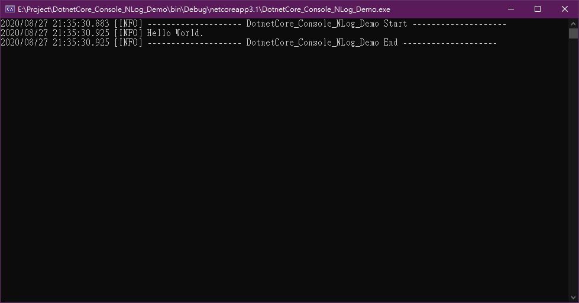
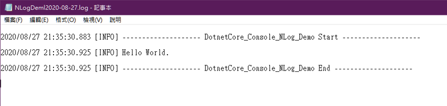

<!--more-->

範例程式：[https://github.com/s123600g/DotnetCore_Console_NLog_Demo](https://github.com/s123600g/DotnetCore_Console_NLog_Demo)

---

### Step 1. 建立 .net core console app 專案

手動使用Microsoft Visual Studio建立.Net Core 3.1 Console專案。

---

### Step 2. 對專案安裝相關套件，使用Nuget套件管理員進行

* NLog.Extensions.Logging
* Microsoft.Extensions.Configuration.FileExtensions
* Microsoft.Extensions.Configuration.Json
* Microsoft.Extensions.Configuration

---

### Step 3. 建立組態設定檔 `appsettings.json`

```json
{
  "NLog": {
    "autoReload": true,
    "throwConfigExceptions": false,
    "internalLogLevel": "info",
    "internalLogFile": "${basedir}/logs/internal-nlog/internal-nlog.txt",
    "targets": {
      "logfile": {
        "type": "File",
        "fileName": "${basedir}/logs/NLogDeml${shortdate}.log",
        "layout": "${date} [${uppercase:${level}}] ${message} ${exception}${newline}"
      },
      "logconsole": {
        "type": "Console",
        "layout": "${date} [${uppercase:${level}}] ${message} ${exception}"
      }
    },
    "rules": [
      {
        "logger": "*",
        "minLevel": "Debug",
        "writeTo": "logfile,logconsole"
      }
    ]
  }
}
```

關於NLog設定參數可參考
* [https://nlog-project.org/config/](https://nlog-project.org/config/)
* [https://github.com/nlog/nlog/wiki/Configuration-file](https://github.com/nlog/nlog/wiki/Configuration-file)

要設定紀錄輸出目的端是在`"targets"` 在上面設定中，有兩種輸出目的端一種是寫入到記錄檔(`File`)，另一種是輸出至Console畫面視窗中(`Console`)。

* `"type"` 輸出目的類型
* `"fileName"` 如果是輸出記錄檔，跟此設置有關
* `"layout"` 跟輸出顯示格式有關

有關內容參數值可參考 [https://nlog-project.org/config/?tab=layout-renderers](https://nlog-project.org/config/?tab=layout-renderers)

要設定輸出規則是在`"rules"`

* `"logger"` 可以設置紀錄內容樣式匹配，可參考 [Configuration-file#logger-name-filter](https://github.com/nlog/nlog/wiki/Configuration-file#logger-name-filter)
* `"minLevel"` 設置紀錄層級最低開始點，可參考[Configuration-file#logger-level-filter](https://github.com/nlog/nlog/wiki/Configuration-file#logger-level-filter)
* `"writeTo"` 設置規則匹配紀錄要將內容輸出至哪一個目的端，可參考[Configuration-file#rules](https://github.com/nlog/nlog/wiki/Configuration-file#rules)

---

### Step 4. 完成Program.cs內容

<script src="https://gist.github.com/s123600g/6472e224dd90d0a0131868a216cd1786.js"></script>

---

### Step 5. 建置專案並執行



在專案目錄`bin\Debug\netcoreapp3.1`底下可以看到`logs/`目錄，NLog產生記錄檔放置在此目錄底下



初步建置過程碰到下面問題，筆記解決方式

```
嚴重性 程式碼 說明 專案 檔案 行 隱藏項目狀態
錯誤 CS1061  'IConfigurationBuilder' 未包含 'AddJsonFile' 的定義，也找不到可接受類型 'IConfigurationBuilder' 第一個引數的可存取擴充方法 'AddJsonFile'(是否遺漏 using 指示詞或組件參考?) DotnetCore_Console_NLog_Demo E:\Project\DotnetCore_Console_NLog_Demo\Program.cs  16  作用中
```

根據 [https://stackoverflow.com/a/27382878](https://stackoverflow.com/a/27382878)，在Nuget加入此套件 → [`Microsoft.Extensions.Configuration.Json`](https://www.nuget.org/packages/Microsoft.Extensions.Configuration.Json/)

---

#### 相關參考

1. [NLog](https://github.com/NLog/NLog)
2. [NLog Configuration-file Rules](https://github.com/nlog/nlog/wiki/Configuration-file#rules)
3. [NLog Get Start](https://nlog-project.org/download/)
4. [Getting started with .NET Core 2 Console application](https://github.com/NLog/NLog/wiki/Getting-started-with-.NET-Core-2---Console-application)
5. [NLog configuration with appsettings.json](https://github.com/NLog/NLog.Extensions.Logging/wiki/NLog-configuration-with-appsettings.json)

