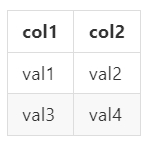

<!--more-->

## 語法結構

結構上有分為以下區塊
1. 屬性區塊
2. ajax區塊
3. 資料欄位區塊(columns)
4. 語言區塊(language)
5. 欄位元素定義區塊(columnDefs)
6. 列元素區塊(rowCallback)

---

## (一) 呼叫初始化語法

JQuery初始化語法
```javascript
 $(datatable_id).DataTable()
```
**datatable_id**對應為Table元件ID，以下面Table元件為例
```html
<table id="test_table"></table>
```
在JQuery初始化語法呈現如下
```javascript
$("#test_table").DataTable()
```

完整語法結構
```javascript
$(datatable_id).DataTable(
    // 屬性區塊,
    // ajax區塊,
    // 資料欄位區塊(columns),
    // 語言區塊(language),
    // 欄位元素定義區塊(columnDefs),
    // 列元素區塊(rowCallback)
)
```

---

## (二) 屬性區塊

在Datatables歸類在Options內，可參考
[https://datatables.net/reference/option/](https://datatables.net/reference/option/)

屬性區塊在語法結構範例如下
<script src="https://gist.github.com/s123600g/ebc8ee70f98df5c05b5964551273146f.js"></script>

* **"searching"**: 
是否開啟搜尋欄位，參數值有true/false。

* "**paging**": 
設置是否要開啟分頁功能，參數值有true/false。

* "**sPaginationType**":
分頁功能呈現樣式，預設參數值"full_numbers"
關於官方說明可參考 [https://datatables.net/reference/option/pagingType](https://datatables.net/reference/option/pagingType)

* "**lengthMenu**": 
設置顯示筆數下拉選單內，顯示可區分幾筆參數
預設參數值 [[10, 25, 50, -1], [10, 25, 50, "All"]]，代表要顯示10、25、50筆資料，其中 -1是告訴Datatables要關閉分頁欄位，因為是顯示全部資料，所以到這裡也可以發現它是跟"ALL"配對呼應的，只是要有一個開關去告訴Datatables要關閉分頁欄位，不然顯示全部資料那分頁就應該不需要存在才對。

* "**processing**": 
當頁面剛載入時候，是否要顯示當前資料處理狀態資訊，參數值有true/false

* "**serverSide**": 
設置是否透過Server端處理分頁、排序、過濾處理機制模式，也就是決定這三者功能是否給Server端處理好在回傳給前端顯示，或者，全都給Client端去做處理，參數值有true/false。
全都給Client端處理情況下，必須要注意資料量多寡問題，當資料筆數是非常龐大的時候，受限於電腦效能，如果電腦效能不太穩定可能會帶來不好的體驗，並且也要考慮到資料安全問題，因為必須要將全部資料回傳給Client端自己去做分頁、排序、過濾處理機制。
給予Server端處理情況下，透過ajax與指定API發送請求，透過特定關鍵字條件參數，告知後端要在特定條件參數值下，回傳符合的結果資料即可，不需回傳全部的資料給前端處理。

* "**stateSave**": 
設置在頁面刷新時，是否要保存當前表格資料與狀態，不保存便會在刷新時回復到原始初始狀態，參數值有true/false。

* "**destroy**": 
設置每一次Datatables有做修改時，是否銷毀當前暫存資料，參數值有true/false。

* "**info**":
設置是否要顯示Datatables基本資訊狀態欄，參數值有true/false。

* "**autoWidth**": 
設置是否要自動調整表格寬度(自適應當前資料量設置表格寬度)，如果為false代表不要自適應，讓表格寬度遠永填滿當前所在區塊大小，參數值有true/false。

* "**ordering**": 
設置是否要開啟欄位排序，如果為true情況下，可以點擊header欄位來進行當前資料排序，點哪一個欄位就是以該欄位作為排序依據，參數值有true/false。

* "**scrollCollapse**": 
設置是否開始滾軸功能控制X、Y軸，參數值有true/false。

* "**scrollY**": 
設置Y軸最大高度，如果有設置此選項就會開啟Y軸滾軸功能，假設為"200px"代表最大高度為200px，當資料筆數呈現高度超過此限制就會開啟滾軸功能。

* "**scrollX**":
設置X軸最大寬度，如果有設置此選項就會開啟X軸滾軸功能，假設為"500px"代表最大寬度為500px，當資料筆數呈現寬度超過此限制就會開啟滾軸功能。

* "**dom**": 
設置各Datattables元件所處在位置，
可參考關於Datatables各元件位置設定(DOM positioning)
[https://datatables.net/examples/basic_init/dom.html](https://datatables.net/examples/basic_init/dom.html)
```
    '<"top">rt<"bottom"><"clear">'
    
    l - length changing input control
    f - filtering input
    t - The table!
    i - Table information summary
    p - pagination control
    r - processing display element
```

---

## (三) ajax區塊

可參考關於Datatables ajax： [https://datatables.net/reference/option/ajax](https://datatables.net/reference/option/ajax)

標準語法結構如下：
<script src="https://gist.github.com/s123600g/5d07d47a006c96aab77f943e09dfecf7.js"></script>

基本參數：

* **url**：
將請求發送給Server端API連結，字串型態。

* **type**:
發送請求型態，一般都是用POST單純請求資料。

---

## (四) 資料欄位區塊(columns)

欄位宣告標準語法結構如下：

<script src="https://gist.github.com/s123600g/ee763f912af3b9aeeca288c35dc7da7f.js"></script>

在Datatables中有幾個欄位就會有幾個"{data: '欄位名稱'}"，此用途是讓Datatables知道Server端回傳的資料中，哪個位置資料是給予哪一個欄位放置，Server端回傳的資料型態JSON格式，每一個位key值就是對應欄位名稱，value值就是該欄位要放置的資料。

假設有一筆Server端回傳的JSON資料為以下：
```
[
    {'col1': 'val1' , 'col2': 'val2'},
    {'col1': 'val3' , 'col2': 'val4'},
]
```

對應資料欄位區塊語法為以下：
```javascript
columns: [
    { data: 'col1' },
    { data: 'col2' },
]
```
在Html Table元件語法結構如下：
```html
<table class="display table-bordered  table table-responsive  table-hover">
    <thead>
        <th class="text-center">col1</th>
        <th class="text-center">col2</th>
    </thead>
</table>
```

最後Table呈現效果如下： <br/>

 <br/>

從這個例子中，你可以發現到資料欄位區塊(columns)內，不管有建立幾個欄位宣告，最後跟有幾筆(列)資料是無關的，它只跟有幾個欄位有關係，如果你建立的欄位宣告有缺少，或者不符合回傳的資料對應欄位key，會出現錯誤，需要注意這一點。

---

## (五) 語言區塊(language)

此區塊針對DataTables內各區塊所顯示資訊語言，可以自訂要呈現內容，例如當資料還在載入初始化時，可以自訂當前狀態敘述內容，或者分頁功能內按鈕名稱等等。
<script src="https://gist.github.com/s123600g/c30435cba60d8baf9ca3f23e334473d7.js"></script>

---

## (六) 欄位元素定義區塊(columnDefs)

可參考關於Datatables option — columnDefs： [https://datatables.net/reference/option/columnDefs](https://datatables.net/reference/option/columnDefs)

標準語法結構如下：
<script src="https://gist.github.com/s123600g/2d735048aa7d4d04040c52190affe59e.js"></script>

基本參數：
* **targets**：
指定該區塊所套用的欄位目標，依據索引值來指定哪一個欄位，起始值是從0開始算起，可以選擇單一目標或多個目標一起套用。
當只有一個目標時，可以用以下宣告方式：
    ```
    targets: 0
    ```
    或者
    ```
    targets: [0]
    ```
    當有多個目標時，可以用以下宣告方式：
    ```
    targets: [0,1,2,...]
    ```
    當要指定全部欄位目標時，可以用以下宣告方式：
    ```
    targets: '_all'
    ```
    **'_all'** 代表全部欄位的意思。
    
* **屬性項目**：
指定該區塊內目標欄位，要套用的屬性項目設定。

例如：指定第一個欄位和第二個欄位內的值都套用置中對齊
    ```
    {
        targets: [0, 1],
        className: 'text-center'              
    }
    ```
    
例如：將第三個欄位顯示的是時間，想要改變時間顯示格式為YYYY-MM-DD，時間格式套件設定採用momentjs，可參考 https://momentjs.com/
    
<script src="https://gist.github.com/s123600g/7dd3aaed7b86a7e6ef6c09f8832043a8.js"></script>
    
例如：要為第一個欄位加入css樣式，控制欄位寬度百分比

<script src="https://gist.github.com/s123600g/32d2dba47e4f8ed1641f8a2b3cdad298.js"></script>

---

## (七) 列元素區塊(rowCallback)

可參考關於Datatables rowCallback： [https://datatables.net/reference/option/rowCallback](https://datatables.net/reference/option/rowCallback)

標準語法結構如下：
<script src="https://gist.github.com/s123600g/d53957716d3c7f6ab55444472615eae2.js"></script>

有關於function參數說明，請參考上方連結內說明。
最常使用的參數為以下：
* **row**：
此為代表一列也就是該筆資料列。
* **data**：
此為代表該列內欄位資料，如果要取該列內指定欄位資料，可以用以下方式取值
    ```
    data[欄位key值]
    ```
    例如：有一個欄位名為'status'，要取出此欄位值用以下方是進型行：
    ```
    data['status']
    ```

假設要為一整列套用一個背景色CSS樣式，使用BootStrap顏色類別名，在該列添加一個CSS類別為BootStrap顏色類別名'warning'，可以用以下方式：
<script src="https://gist.github.com/s123600g/395ad55ae07542fe76276deef18f46cd.js"></script>

---

## (八) 完整範例格式

Html
<script src="https://gist.github.com/s123600g/1af02bce18cf117a631a93e0a14369d3.js"></script>

JQuery：
<script src="https://gist.github.com/s123600g/3cf2931e00c4306454dbab0a17f55f8b.js"></script>

---

#### 相關參考

* [datatables](https://datatables.net/)


