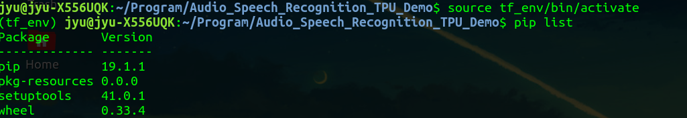
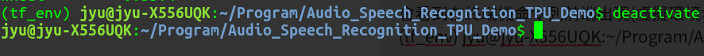
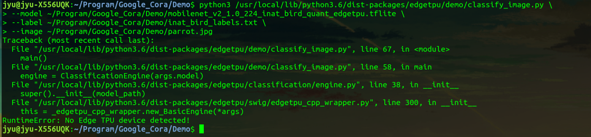
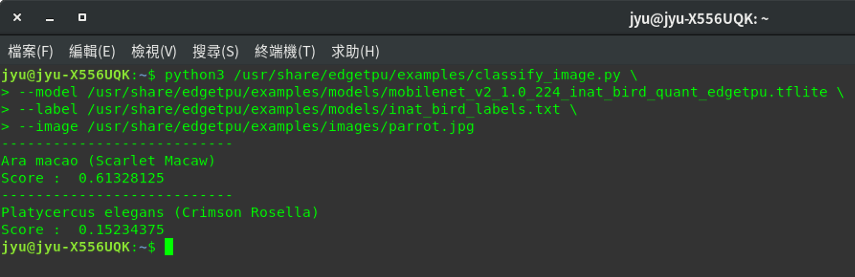

<!--more-->

## 前言

此應用專案為探討如何建置一個簡單語音識別例子，並使用[Google Coral USB Accelerator](https://coral.withgoogle.com/docs/accelerator/get-started/)、Tensorflow 搭配在筆記型電腦環境上進行開發實作。

有關於Google Coral說明可參考：[https://coral.withgoogle.com/docs/](https://coral.withgoogle.com/docs/) <br/>
有關於Tensorflow說明可參考：[https://www.tensorflow.org/](https://www.tensorflow.org/)

使用硬體規格：
1. Intel® Core™ i5-7200U CPU @ 2.50GHz × 4
2. Ram：12G
3. Google Coral USB Accelerator

後續探討開發重點在於以下幾點：
1. 如何取出語音檔案之特徵值處理實作。
2. 如何建置簡單CNN模型應用在語音分類。
3. 如何進行量化模型訓練，本專案使用**Quantization-aware training**。
4. 將訓練好量化模型進行轉換成tflite模型。
5. 如何將轉換後tflite模型進行Edgetpu Compile 。
6. 如何進行預測之實作。

---

## 開發環境配置

1. 作業系統：`Ubuntu 18.04.2`
2. 開發工具：Visual Studio Code
3. 虛擬環境：virtualenv
4. 程式語言：`Python3.6`
5. Tensorflow版本：
    * tf-nightly `1.15.0.dev20190627`
    * tf-estimator-nightly `1.14.0.dev2019062701`

**Step 1. 檢查是否有安裝python3-pip**

在終端機打以下指令，確認能夠正常顯示當前python3 擁有Package清單

```shell
pip3 list
```


如果未正常顯示代表未安裝python3-pip，在終端機打以下指令進行安裝

```shell
sudo apt-get install python3-pip
```

**Step 2. 安裝虛擬環境virtualenv應用在Python3環境**

在終端機打以下指令，安裝虛擬環境virtualenv

```shell
sudo apt-get install virtualenv
```

**Step 3. 建置專案python虛擬環境**

在終端機打以下指令，進行建立虛擬環境

```shell
virtualenv 自訂虛擬環境名稱 --python=指定python版本
```

假設要建立一個虛擬環境名稱為tf_env，並且指定此虛擬環境使用python版本為python3，此python3與`/usr/bin/python3`相應連結，也就是虛擬環境所建置python版本環境以它作為模板下去建置，但是在python package方面只會產生最基本配置，如果有額外安裝的package並不會一起建置在虛擬環境內。

```shell
virtualenv tf_env --python=python3
```


在終端機打以下指令，進入建置python虛擬環境內

```shell
source 自訂虛擬環境名稱/bin/activate
```

以此例建立虛擬環境**tf_env**為例

```shell
source tf_env/bin/activate
```

會看到在終端機命令列前端出現(虛擬環境名稱)如下



在終端機打以下指令，可離開虛擬環境

```shell
deactivate
```



**Step 4. 在python虛擬環境安裝必要python package**

需要先進入python虛擬環境，才能進行安裝python package，否則會以電腦上實機python環境為主。

python package清單如下：

<script src="https://gist.github.com/s123600g/44b19f69c6d8cdc3b55a2e6d5626aeba.js"></script>

以上套件清單會建立在`requirement.txt`檔案內，並且以讀取套件清單檔案形式進行安裝。

```shell
pip install -r requirement.txt
```


由於Tensorflow 最近改版更新，原本使用tf-nightly 1.15.0.dev20190627已被移除安裝來源，需要使用 Tensorflow 1.15來取代使用

tensorflow 1.15.2 ：[https://pypi.org/project/tensorflow/1.15.2/](https://pypi.org/project/tensorflow/1.15.2/)

```shell
pip install tensorflow==1.15.2
```

**Step 5. 安裝Edge TPU runtime**

參考官方說明文件： <br/>
[https://coral.ai/docs/accelerator/get-started/#1-install-the-edge-tpu-runtime](https://coral.ai/docs/accelerator/get-started/#1-install-the-edge-tpu-runtime)


將官方edgetpu來源加入置sources清單內

```shell
echo "deb https://packages.cloud.google.com/apt coral-edgetpu-stable main" | sudo tee /etc/apt/sources.list.d/coral-edgetpu.list
```

下載官方來源金鑰並加入

```shell
curl https://packages.cloud.google.com/apt/doc/apt-key.gpg | sudo apt-key add -
```

進行更新將來源套件下載

```shell
sudo apt-get update
```

執行套件安裝

```shell
sudo apt-get install libedgetpu1-std
```

**Step 6. 安裝 TensorFlow Lite Library**

參考官方說明文件：  <br/>
[https://coral.ai/docs/accelerator/get-started/#2-install-the-tensorflow-lite-library](https://coral.ai/docs/accelerator/get-started/#2-install-the-tensorflow-lite-library) <br/>
[https://www.tensorflow.org/lite/guide/python#install_just_the_tensorflow_lite_interpreter](https://www.tensorflow.org/lite/guide/python#install_just_the_tensorflow_lite_interpreter)

```shell
pip install https://dl.google.com/coral/python/tflite_runtime-2.1.0.post1-cp36-cp36m-linux_x86_64.whl
```

**Step 7. 安裝 Edge TPU Python API Library**

參考官方說明文件： <br/>
[https://coral.ai/docs/edgetpu/api-intro/#install-the-library-and-examples](https://coral.ai/docs/edgetpu/api-intro/#install-the-library-and-examples)

```shell
sudo apt-get update
sudo apt-get install python3-edgetpu
```

需注意一點的是，這裡所安裝的 Edge TPU Python API Library 是存在實體環境 python裡面，並不存在上面步驟所建置虛擬環境內，執行調用相關 Edge TPU Python API時，請在非虛擬環境底下進行。


**Step 8. 執行Edge TPU Demo範例**

這裡執行的範例是直接使用Edge TPU Python API Demo，關於使用TensorFlow Lite API 官方說明已有介紹，在此不再執行使用TensorFlow Lite API Demo。

參考官方說明文件：<br/>
[https://coral.withgoogle.com/docs/edgetpu/api-intro/](https://coral.withgoogle.com/docs/edgetpu/api-intro/) <br/>
[https://github.com/google-coral/edgetpu](https://github.com/google-coral/edgetpu)

取得examples內容，安裝完畢後所有檔案會放置在`/usr/share/edgetpu/examples`

```shell
sudo apt-get install edgetpu-examples
```


運行之前，請先插入Google Coral USB Accelerator在USB3.0，不然會在運行時發生例外錯誤 "RuntimeError: No Edge TPU device detected!"




**Image classification example**

[https://coral.ai/examples/classify-image/](https://coral.ai/examples/classify-image/)

執行範例程式， 主程式檔案 `classify_image.py`

```shell
python3 /usr/share/edgetpu/examples/classify_image.py \
--model /usr/share/edgetpu/examples/models/mobilenet_v2_1.0_224_inat_bird_quant_edgetpu.tflite \
--label /usr/share/edgetpu/examples/models/inat_bird_labels.txt \
--image /usr/share/edgetpu/examples/images/parrot.jpg
```

* `—-model` 指定使用tflite模型來源
* `—-labels` 指定分類標籤來源
* `—-input` 指定輸入圖片來源



**Object detection example**

[Run the example for object detection](https://coral.ai/examples/detect-image/#run-the-example-for-object-detection)

執行範例程式， 主程式檔案 `object_detection.py`

```shell
python3 /usr/share/edgetpu/examples/object_detection.py \
--model /usr/share/edgetpu/examples/models/mobilenet_ssd_v2_coco_quant_postprocess_edgetpu.tflite \
--label /usr/share/edgetpu/examples/models/coco_labels.txt \
--input /usr/share/edgetpu/examples/images/grace_hopper.bmp \
--output ${HOME}/object_detection_results.jpg
```


[Run the example for face detection](https://coral.ai/examples/detect-image/#run-the-example-for-face-detection)

執行範例程式， 主程式檔案 `object_detection.py`

```shell
python3 /usr/share/edgetpu/examples/object_detection.py \
--model /usr/share/edgetpu/examples/models/mobilenet_ssd_v2_face_quant_postprocess_edgetpu.tflite \
--input /usr/share/edgetpu/examples/images/grace_hopper.bmp \
--output ${HOME}/face_detection_results.jpg
```


---

