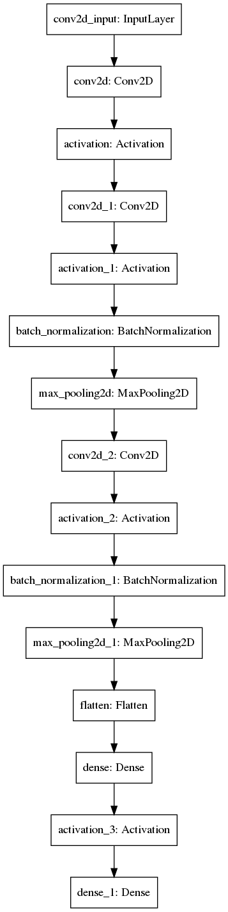
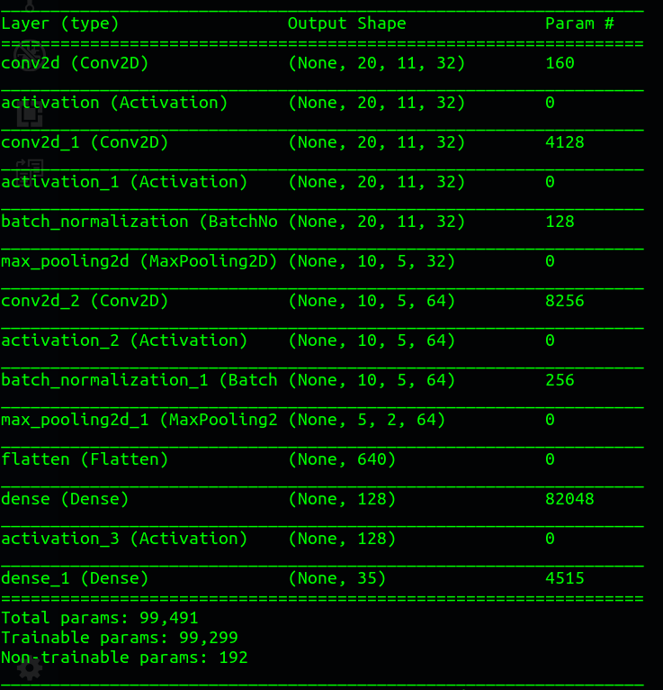
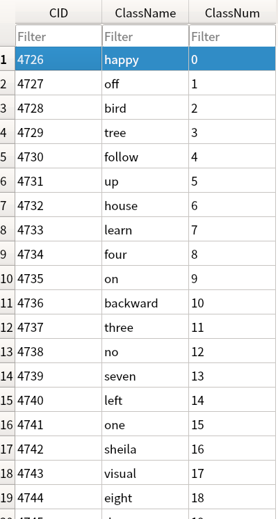
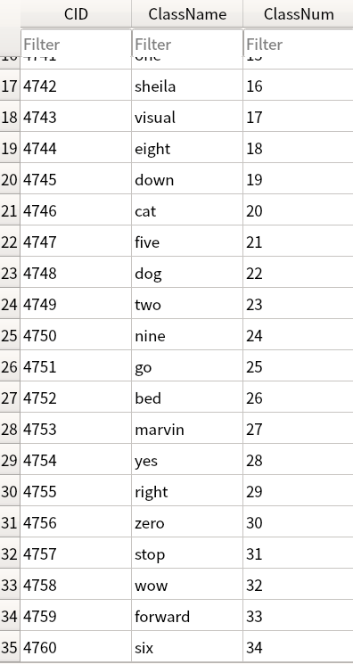
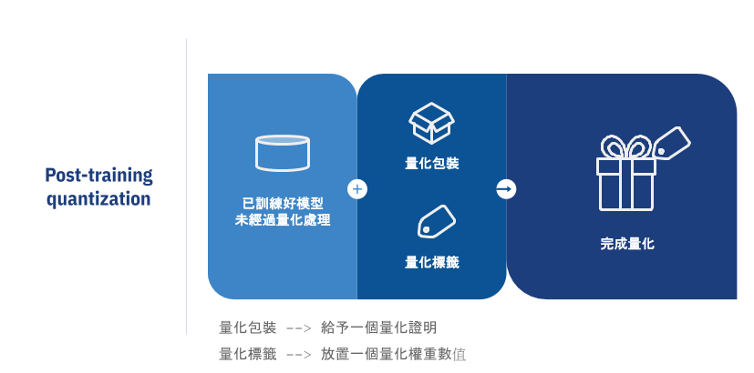
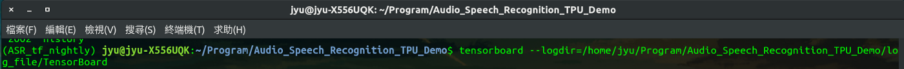
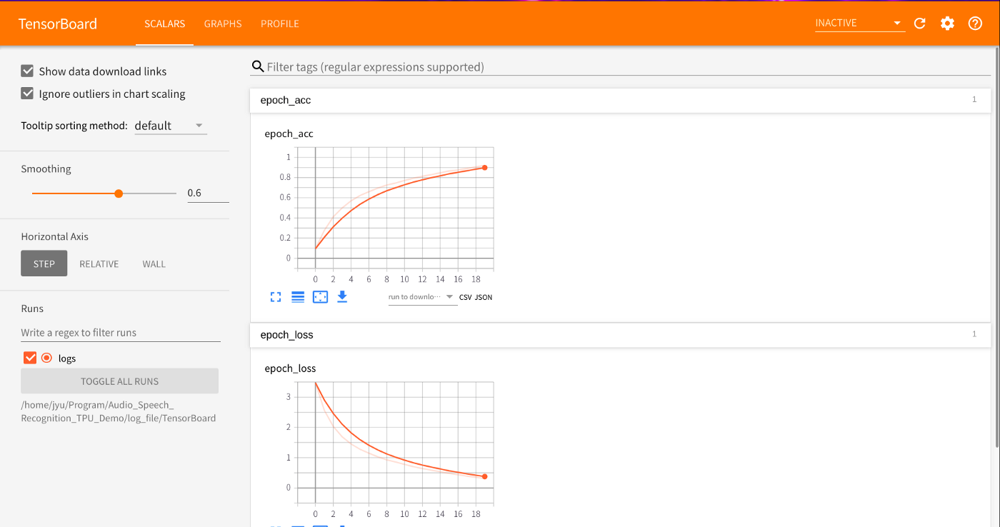
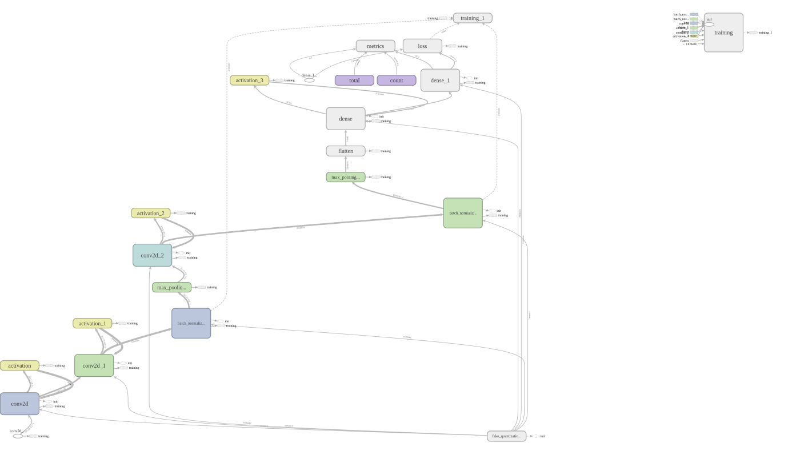

<!--more-->

GitHub：[https://github.com/s123600g/asr_edgetpu_demo](https://github.com/s123600g/asr_edgetpu_demo)

經過[(二) 語音資料集處理](https://s123600g.github.io/google/edgetpu/2019/07/20/%E4%BD%BF%E7%94%A8EdgeTpu%E6%87%89%E7%94%A8%E5%9C%A8%E8%AA%9E%E9%9F%B3%E6%A8%A1%E5%9E%8B%E9%A0%90%E6%B8%AC%E4%B9%8B%E7%B0%A1%E5%96%AE%E5%AF%A6%E4%BE%8B(%E4%BA%8C)-%E8%AA%9E%E9%9F%B3%E8%B3%87%E6%96%99%E9%9B%86%E8%99%95%E7%90%86.html)得到已擷取出來語音特徵檔案，在此階段可以開始建置模型並進行訓練，產生可以用在後面[(四) 模型轉換格式為tflite](https://s123600g.github.io/google/edgetpu/2019/07/20/%E4%BD%BF%E7%94%A8EdgeTpu%E6%87%89%E7%94%A8%E5%9C%A8%E8%AA%9E%E9%9F%B3%E6%A8%A1%E5%9E%8B%E9%A0%90%E6%B8%AC%E4%B9%8B%E7%B0%A1%E5%96%AE%E5%AF%A6%E4%BE%8B(%E5%9B%9B)-%E6%A8%A1%E5%9E%8B%E8%BD%89%E6%8F%9B%E6%A0%BC%E5%BC%8F%E7%82%BAtflite.html)之語音模型。

此階段所使用程式為`Train_Data.py`，包含以下處理程序
1. 產生資料集(訓練、測試、驗證)
2. 建立模型(CNN Model)
3. 量化模型之訓練
4. 儲存訓練中每一回合權重紀錄
5. 儲存訓練後模型tensor graph與權重紀錄
6. TensorBoard使用
7. 驗證模型
8. 輸出模型

程式內部一些必要參數配置，存放在`Config.py`裡面，如需更改請到`Config.py`內找尋對應參數配置進行修改。

---

## 模型結構

首先，要先建置一個簡單的語音模型，此模型結構為卷積神經網絡CNN ，因為只是探討簡單應用實作，所以模型架構先以簡單建置進行。

這次使用Tensorflow內部已包含之Keras套件進行模型建置，而不使用外部安裝形式Keras套件。

模型原始結構資訊如下：





以下為`Train_Data.py`內關於語音模型結構建置與參數配置程式碼

<script src="https://gist.github.com/s123600g/fe0ffd69b914d8a75fd9b5d24eb21ffa.js"></script>

---

## 產生資料集(訓練、測試、驗證)

此為`Gen_DataSet.py`程式負責處理，主要是`Train_Data.py`用來呼叫取得處理後資料集，內部程式代碼呼叫如下

```python
''' 產生訓練、測試、驗證資料集 '''
Gen_DataSet = Gen_DataSet(Config)
Gen_DataSet.DataSet_Process()
```

`Gen_DataSet.py`內`DataSet_Process()`方法，讀取[(二) 語音資料集處理](https://medium.com/@s123600g/%E4%BD%BF%E7%94%A8edgetpu%E6%87%89%E7%94%A8%E5%9C%A8%E8%AA%9E%E9%9F%B3%E6%A8%A1%E5%9E%8B%E9%A0%90%E6%B8%AC%E4%B9%8B%E7%B0%A1%E5%96%AE%E5%AF%A6%E4%BE%8B-%E4%BA%8C-%E8%AA%9E%E9%9F%B3%E8%B3%87%E6%96%99%E9%9B%86%E8%99%95%E7%90%86-a9a1f4492bc0)產生結果，每一個分類特徵文字檔內容全部經過以下處理步驟：

**Step 1. 執行資料分類標籤之對應編號存進資料庫。**  <br/>

將讀取`audio_classlabels.txt`內容存進SQLite3輕量化資料庫中，存放在專案目錄內`DB/class.db3`，此資料庫在之後預測會用到，用來將模型預測結果，進行識別類別名稱查詢用途。





**Step 2. 讀取語音特徵值檔案內容，取得每一筆特徵值內容與分類標籤。** <br/>

**Step 3. 將所有已讀取完每一筆特徵值內容與分類標籤進行資料混淆矩陣打散。** <br/>

**Step 4. 將每一筆特徵值所屬分類標籤進行轉換成對應編號，與SQLite3資料庫內資料表，每一分類所屬編號內容相對應。** <br/>

在上階段語音資料集處理，有產生分類標籤之對應編號結果，將其讀取進來內容如下：

```
{
	0: 'backward', 
	1: 'bed', 
	2: 'bird', 
	3: 'cat', 
	4: 'dog',
	5: 'down', 
	6: 'eight', 
	7: 'five', 
	8: 'follow', 
	9: 'forward', 
	10: 'four', 
	11: 'go', 
	12: 'happy', 
	13: 'house', 
	14: 'learn', 
	15: 'left', 
	16: 'marvin', 
	17: 'nine', 
	18: 'no', 
	19: 'off', 
	20: 'on', 
	21: 'one', 
	22: 'right', 
	23: 'seven', 
	24: 'sheila', 
	25: 'six', 
	26: 'stop', 
	27: 'three', 
	28: 'tree', 
	29: 'two', 
	30: 'up', 
	31: 'visual', 
	32: 'wow', 
	33: 'yes', 
	34: 'zero'
}
```

在**Step2**所產生分類標籤矩陣內部格式為以下： <br/>

['wow', 'nine', 'five', ... ,'dog' ,'tree', 'forward'] <br/>

必須要轉換為之前已設定好每一分類對應之編號，不能給模型標籤內容為字串形式，必須要轉換為整數型態數值，因為後面還有One-Hot編碼轉換，要求必須為整數格式進行，轉換後內容如下： <br/>

[32 ,17,7, … ,4,28,9] <br/>

編號對應分類範例：
* 32 → 'wow'
* 17 → 'nine'
* 7 → 'five'

**Step 5. 產生訓練模型所需資料集(訓練、驗證、測試)** <br/>

在這裡就會產生要給模型用之訓練與驗證用資料集，還有後面用來測試模型準確度之資料集，分別對應如下：
1. `self.Config.Train_DataSet` --> 放置訓練用內容資料集。
2. `self.Config.Train_Labels` --> 放置訓練用標籤資料集。
3. `self.Config.Valid_DataSet` --> 放置驗證用內容資料集。
4. `self.Config.Valid_Labels` --> 放置驗證用標籤資料集。
5. `self.Config.Test_DataSet` --> 放置測試用內容資料集。
6. `self.Config.Test_Labels` --> 放置測試用標籤資料集。

以上資料經過以下處理程序所產生：
1. 切割資料集、將經過**Step 2** ~ **Step 4**處理後，將存放所有語音特徵`self.Config.MFCC_Data`與`self.Config.labels`進行比例切割成三等份資料集結果(訓練、驗證、測試)。
2. 轉換資料集結果(訓練、驗證、測試)為Numpy Array型態。
3. 轉換資料集結果(訓練、驗證、測試)小數精度為 float32。
4. 轉換資料集結果(訓練、驗證、測試) 向量維度(Shape)轉換，轉成(15750 , 20 , 11 , 1)格式
   - 關於轉換格式： `(語音特徵總筆數 , 每一筆特徵列數 , 每一筆特徵欄位數 , Channel)`

**Step 6. 將所有資料集(訓練、驗證、測試)之分類標籤編號進行One-Hot 編碼** <br/>

---

## 進行模型量化訓練

在Tensorflow量化訓練中有兩種方式，以下為個人白話理解其運作概念：

第一種為**Post-training quantization**，此種方式為將已訓練好模型，插入一個宣告已量化證明，來告知此模型已完成量化，但畢竟不是真的經過訓練中進行量化過程，而只是給予一個模擬量化後權重，有點類似於將已訓練好未經過訓練過程量化之模型，給予一個模擬經過量化後之證明，告知此模型已有量化，是偽量化處理之一，但是，實際在inference()執行下，對於權重還是沒有使用量化數值型態uint8，而是以原始float數值型態來進行。



第二種為**Quantization-aware training (Qat)**，此處理分為訓練前與訓練後，分別是 create_training_graph 與 create_eval_graph 兩個階段 ，在訓練前會進行插入 fake quantization nodes 在模型中，並且先經過初始化後，在訓練過程中，會存放經過激活函數處理後權重，在經過量化處理產生數據，也就是每一層 fake quantization node 內存放最小值與最大值，此為一個偽量化處理(模擬量化)，模型訓練後，在將整個模型之權重數據包含量化數據，進行一個變量轉換常量動作，也就是固定所有數值後，在輸出成pb格式模型檔案。


可參考 [連結1](https://tensorflow.juejin.im/performance/quantization.html) [連結2](https://blog.csdn.net/lishanlu136/article/details/88872266) [連結3](https://www.tensorflowers.cn/t/7136) [連結4](https://zhuanlan.zhihu.com/p/62047684)


Google Coral 官方在[Quantization](https://coral.ai/docs/edgetpu/models-intro/#quantization)區塊內說明

本專案主要使用量化方式為**Qat**，你必須了解**Qat**量化在實作架購上，所調用tf.contrib.quantize api function內容分別為：
1. [create_training_graph](https://www.tensorflow.org/versions/r1.15/api_docs/python/tf/contrib/quantize/create_training_graph?hl=zh_tw)
2. [create_eval_graph](https://www.tensorflow.org/versions/r1.15/api_docs/python/tf/contrib/quantize/create_eval_graph?hl=zh_tw)

實作上需要做的步驟有以下：

**Step 1. 訓練模型與儲存模型所有graph與checkpoints(create_training_graph)** <br/>
1. 在訓練模型之前，將已產生模型結構(還未進行模型編譯生成)，插入放置量化權重數據之 fake quantization nodes，這些量化權重數據指的是放置最小值與最大值資訊，用來後面進行 tflite 模型透過 inference() 執行時使用。
2. 進行模型編譯生成，並且重新初始化模型權重，開始模型之訓練，在訓練過程中，會將需要進行量化之權重變量，自動進行量化計算放置到 fake quantization node，訓練完畢後，儲存總體 graph 與 checkpoints 到外部檔案。
3. 將模型訓練過程，輸出成可視覺化圖檔(png)。
   - 調用`history_plot.py`進行模型訓練過程可視覺化圖檔。
4. 可以用TensorBoard觀看訓練過程變化，需要再訓練完畢後才會完整顯示

需要做以下設置

```python
''' 設置模型訓練時之回調函數控制 '''
callbacks = [
    # TensorBoard設置
    tf.keras.callbacks.TensorBoard(        
        # 輸出檔案位置
        log_dir=Config.Log_TensorBoard_Path,        
        batch_size=batch_size,        
        write_images=True,    
    ),

    #設置儲存每一回合儲存Checkpoint紀錄
    tf.keras.callbacks.ModelCheckpoint(
        # 輸出儲存檔案配置(檔案路徑,檔案命名格式)
        filepath=os.path.join(Config.Model_ModelCheckpoint_Path, "ckpt_{epoch:02d}"),        
        # 顯示儲存過程
        verbose=1,        
        # 設置是否只儲存權重
        save_weights_only=False    
    ),
]
```

在終端機執行以下指令

```shell
tensorboard --logdir= TensorBoard Log 放置位置
```

此專案範例格式
```shell
tensorboard --logdir=/home/jyu/Program/Audio_Speech_Recognition_TPU_Demo/log_file/TensorBoard
```



執行後會顯示以下連結資訊，點擊即可查看
http://127.0.0.1:6006/#scalars&run=logs



量化模型訓練過程視覺化(Tensorboard Graph)



**Step2. 進行模型之輸出(create_eval_graph)** <br/>
1. 重新取得模型結構，建立重新模擬量化之驗證graph。
2. 取得模型內部結構，包含節點、內部函數數值等等。
3. 重新載入儲存權重變數，也就是 Step1. 儲存總體 graph 與 checkpoints。
4. 將模型中所有的變量轉換成相同數值常量。
5. 輸出pb格式模型。
   - 輸出模型存放位置在專案目錄內`model/model_pb/`
   - 模型名稱為`frozen_model.pb`

---

## 執行結果

到目前為止針對建立模型與訓練，我們已訓練好所需量化模型，並且輸出成pb格式模型檔案，接下來就可以進行[(四) 模型轉換格式為tflite](https://s123600g.github.io/google/edgetpu/2019/07/20/%E4%BD%BF%E7%94%A8EdgeTpu%E6%87%89%E7%94%A8%E5%9C%A8%E8%AA%9E%E9%9F%B3%E6%A8%A1%E5%9E%8B%E9%A0%90%E6%B8%AC%E4%B9%8B%E7%B0%A1%E5%96%AE%E5%AF%A6%E4%BE%8B(%E5%9B%9B)-%E6%A8%A1%E5%9E%8B%E8%BD%89%E6%8F%9B%E6%A0%BC%E5%BC%8F%E7%82%BAtflite.html)。

<script src="https://gist.github.com/s123600g/cc27e978a9f5266641b29fb91408cc0d.js"></script>

---
