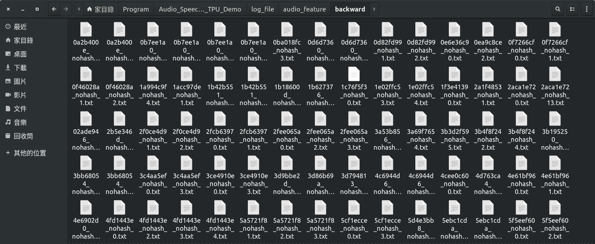

<!--more-->

GitHub：[https://github.com/s123600g/asr_edgetpu_demo](https://github.com/s123600g/asr_edgetpu_demo)

關於環境配置部分請參考 [(一)前言與開發環境配置](https://s123600g.github.io/google/edgetpu/2019/07/20/%E4%BD%BF%E7%94%A8EdgeTpu%E6%87%89%E7%94%A8%E5%9C%A8%E8%AA%9E%E9%9F%B3%E6%A8%A1%E5%9E%8B%E9%A0%90%E6%B8%AC%E4%B9%8B%E7%B0%A1%E5%96%AE%E5%AF%A6%E4%BE%8B(%E4%B8%80)-%E5%89%8D%E8%A8%80%E8%88%87%E9%96%8B%E7%99%BC%E7%92%B0%E5%A2%83%E9%85%8D%E7%BD%AE.html)

在此階段我們要將語音檔案擷取出語音特徵，並且產生下一階段**(三)建置模型並訓練**所使用資料來源。

關於一些必要參數配置，可在`Config.py` 裡面找到，如需改請找到對應參數進行修改。

使用Tensorflow官方[Simple Audio Recognition](https://www.tensorflow.org/tutorials/sequences/audio_recognition)例子內所使用之語音資料。

語音資料來源：[https://storage.cloud.google.com/download.tensorflow.org/data/speech_commands_v0.02.tar.gz](https://storage.cloud.google.com/download.tensorflow.org/data/speech_commands_v0.02.tar.gz)

語音資料內容為收集眾多不同人對於單字詞，進行口說錄音語音檔案(wav)，每一個音檔時間為一秒，共有35個分類(每一類為一個資料夾)。

`Config.py`內一些參數如下：
* `data_quantity_max`--> 此參數主要管控要對一個類別產生多少個語音特徵文字檔。
  - 例如：data_quantity_max ＝ 450
    - 代表每一個類別要產生450個語音特徵文字檔，總共會產生15750個語音特徵文字檔。
* `sample_rate` --> 語音之頻率參數。
* `max_pad_len`，語音特徵向量內每一個位置長度。
* `channel` --> single channel。
* `Audio_Data_Directory_Root` --> 音頻檔案目錄所在位置。
* `Audio_Data_DirectoryName` --> 音頻檔案目錄名稱
* `Log_DirectoryName` --> 擷取出來相關檔案放置位置。
* `log_file_type` --> 檔案類型，預設使用txt。
* `Log_FeatureData_DirectoryName` --> 放置所有特徵檔案目錄名稱。
* `Log_ClassLabelsData_DirectoryName` --> 放置分類對應表檔案目錄名稱。

內部針對語音特徵擷取之處理，實際是在`Load_Data.py`進行，使用Python Package — librosa 進行 MFCC 特徵擷取

有關 librosa 資訊可參考：
* [https://github.com/librosa/librosa](https://github.com/librosa/librosa)
* [https://blog.manash.me/building-a-dead-simple-word-recognition-engine-using-convnet-in-keras-25e72c19c12b](https://blog.manash.me/building-a-dead-simple-word-recognition-engine-using-convnet-in-keras-25e72c19c12b)
* [https://ithelp.ithome.com.tw/articles/10195763](https://ithelp.ithome.com.tw/articles/10195763)

關於 MFCC 特徵值如何取得，使用 librosa 內 librosa.core.load()方法進行讀取語音檔案，給予必要2個參數分別是**path**(語音檔案來源)與**sr**(採樣頻率)。

**path**會在程式中自動抓取判斷，sr是對應在`Config.py`內`sample_rate`參數配置，預設為16000。

```python
wave, sr = librosa.load(file_path, mono=True, sr=sample_rate)
```

將讀取語音內容進行長度裁切處理，從0索引位置開始，每隔3個位置取出一次內容，也就是內容總長度/3。

```python
wave = wave[::3]
```

使用 librosa 內 librosa.feature.mfcc ()方法進行MFCC特徵值擷取，給予必要2個參數分別是`wave`(語音檔案內容)與`sr`(採樣頻率)。

```python
mfcc = librosa.feature.mfcc(wave, sr=sample_rate)
```

---

## 開始執行語音特徵資料擷取

主要執行程式： `Gen_Datafile.py`

如果要更動來源位置或目錄名稱，請更改在`Config.py`內以下參數值
* `Audio_Data_Directory_Root`
* `Audio_Data_DirectoryName`

執行前需注意一點，確認是否已切入至python虛擬環境，如已切入至該虛擬環境內，在執行python3程式時，可以直接以python指令進行，因為在建立虛擬環境時，是以python3版本進行環境建置，python指令會直接指向python3。

在終端機打以下指令，執行`Gen_Datafile.py`

```shell
python Gen_Datafile.py
```


執行結果會根據在`Config.py`以下參數設置
* `Log_DirectoryName`
* `Log_FeatureData_DirectoryName`
* `Log_ClassLabelsData_DirectoryName`

預設在專案目錄內`log_file/`，放置處理後兩個結果，分別放置目錄名稱如下：

1. `log_file/audio_feature` 資料目錄

    放置 35 個類別各自 450 個語音特徵文字檔，每一筆語音特徵結構為(20,11)，也就是每一個語音會產生 20 列特徵值，並且每一筆特徵長度會是 11 欄。
    
    

2. `log_file/audio_classlabels` 資料目錄

    `audio_classlabels.txt`放置每一個分類之編號文字檔，編號從0開始，也就是35個類別範圍在0~34，此編號用在預測識別結果查詢上。

    


到目前階段為止，針對語音特徵資料之處理，我們已產生各類別自己450個語音特徵文字檔與放置各類別所屬編號`audio_classlabels.txt`檔案。

---

