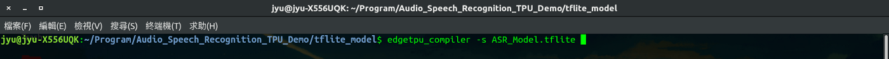
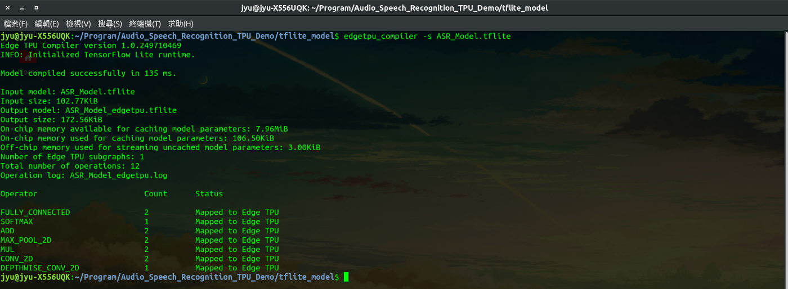
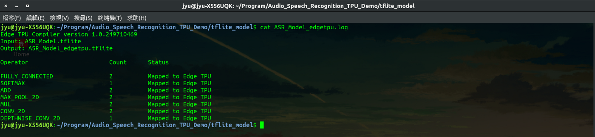
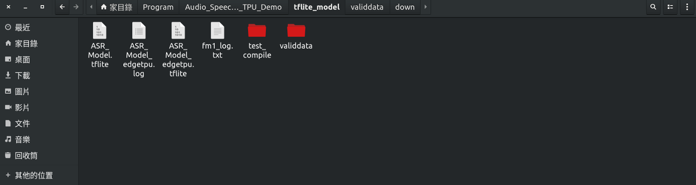

<!--more-->

GitHub：[https://github.com/s123600g/asr_edgetpu_demo](https://github.com/s123600g/asr_edgetpu_demo)

經過[(四) 模型轉換格式為tflite](https://s123600g.github.io/google/edgetpu/2019/07/20/%E4%BD%BF%E7%94%A8EdgeTpu%E6%87%89%E7%94%A8%E5%9C%A8%E8%AA%9E%E9%9F%B3%E6%A8%A1%E5%9E%8B%E9%A0%90%E6%B8%AC%E4%B9%8B%E7%B0%A1%E5%96%AE%E5%AF%A6%E4%BE%8B(%E5%9B%9B)-%E6%A8%A1%E5%9E%8B%E8%BD%89%E6%8F%9B%E6%A0%BC%E5%BC%8F%E7%82%BAtflite.html)，此階段進行使用 edgetpu_compiler 轉換EdgeTpu可識別tflite模型。

因應在官方說明文件[TensorFlow models on the Edge TPU](https://coral.withgoogle.com/docs/edgetpu/models-intro/)區塊提到，要能夠讓EdgeTpu能識別使用之tflite模型，必須要先將一個包含fake qnantization nodes的模型(type float 32)，經過 Quantization-aware training 量化感知訓練後，產生一個量化模型(pb model , type uint8)，經過 Frozen Graph 處理與Convert(TOCO)，最後，透過 edgetpu_compiler 指令轉換成EdgeTpu可識別模型(tflite)。

參考官方說明文件 - Edge TPU Compiler：
[https://coral.withgoogle.com/docs/edgetpu/compiler/](https://coral.withgoogle.com/docs/edgetpu/compiler/)

---

## 前置準備
在官方說明文件中 Download 區塊，進行安裝 edgetpu_compiler 指令工具。
安裝之前請先查看 System requirements 區塊，確認都有符合環境要求。

---

## 執行編譯模型
在官方說明文件中 Usage 區塊，提到 edgetpu_compiler 指令操作與項目說明

指令格式如下：
```shell
edgetpu_compiler [options] model...
```
首先，要先確認使用轉換的tflite模型來源。

在專案目錄內`tflite_model/ASR_Model.tflite`

edgetpu_compiler 參考指令格式：

```shell
edgetpu_compiler -s model
```

- 要使用指令參數項目為 `-s` ，功用為在執行過程中顯示轉換訊息與產生訊息紀錄檔案。

edgetpu_compiler 專案實際執行指令：

```shell
edgetpu_compiler -s /home/jyu/Program/Audio_Speech_Recognition_TPU_Demo/tflite_model/ASR_Model.tflite
```





預設轉換後 EdgeTpu 模型位置會在終端機目前位置底下。

轉換後會產生2個檔案如下：

**1. `ASR_Model_edgetpu.log` --> 轉換過程訊息紀錄檔案**

透過指令`cat`查看`ASR_Model_edgetpu.log`內容

```shell
cat ASR_Model_edgetpu.log
```



<script src="https://gist.github.com/s123600g/f5d89147ffd5a510aad3f4eed6b4cbed.js"></script>


**2. `ASR_Model_edgetpu.tflite` - - > 轉換後EdgeTpu模型**



接下來就可以進行**(六) 進行 EdgeTpu 模型預測**。

---
