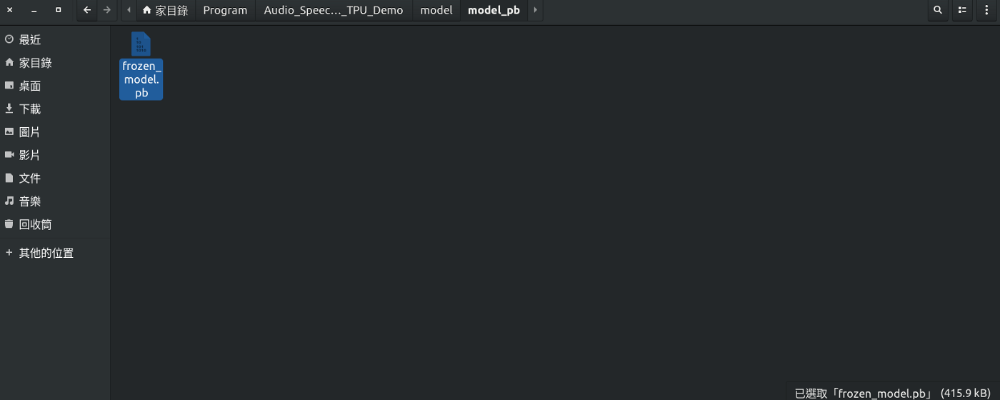
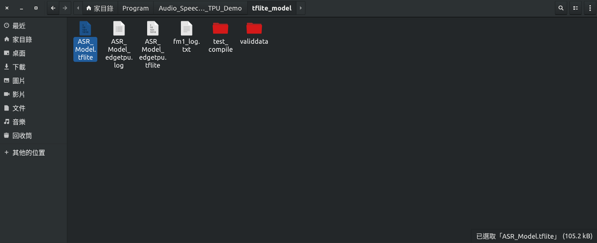
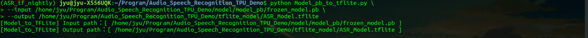
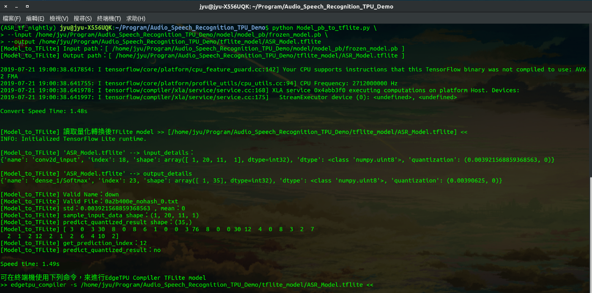
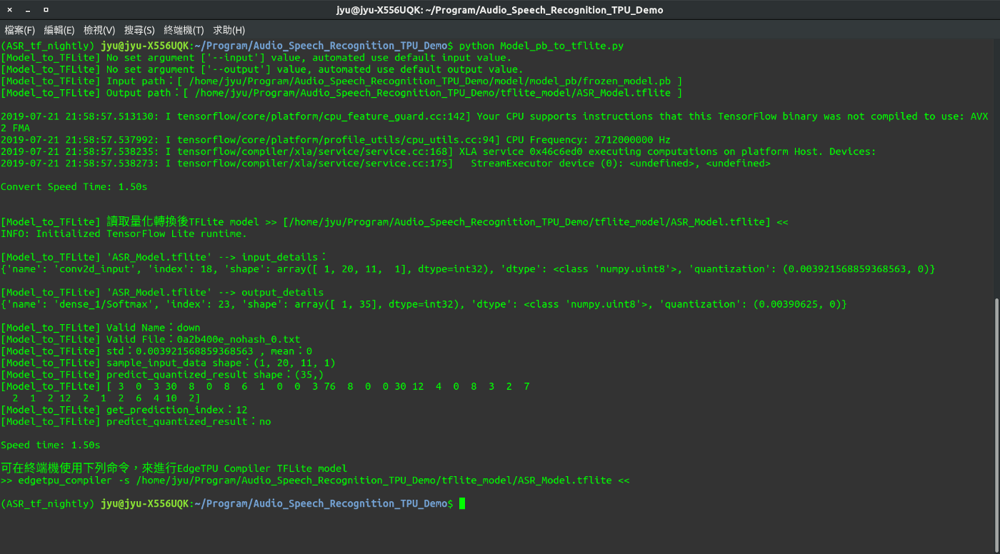

<!--more-->

GitHub：[https://github.com/s123600g/asr_edgetpu_demo](https://github.com/s123600g/asr_edgetpu_demo)

經過[(三) 建立模型與訓練](https://s123600g.github.io/google/edgetpu/2019/07/20/%E4%BD%BF%E7%94%A8EdgeTpu%E6%87%89%E7%94%A8%E5%9C%A8%E8%AA%9E%E9%9F%B3%E6%A8%A1%E5%9E%8B%E9%A0%90%E6%B8%AC%E4%B9%8B%E7%B0%A1%E5%96%AE%E5%AF%A6%E4%BE%8B(%E4%B8%89)-%E5%BB%BA%E7%AB%8B%E6%A8%A1%E5%9E%8B%E8%88%87%E8%A8%93%E7%B7%B4.html)，此階段進行將模型轉換成 tflite 模型，產生可以用在**(五) 使用 edgetpu_compiler 轉換 EdgeTpu 可識別 tflite模型**。

此階段所使用程式為`Model_pb_to_tflite.py`。

程式內部一些必要參數配置，存放在`Config.py`裡面，如需更改請到`Config.py`內找尋對應參數配置進行修改。

轉換之前在專案目錄內`model/model_pb/frozen_model.pb`模型大小為415.9kB



轉換成tflite模型`tflite_model/ASR_Model.tflite`大小為105.2kB



#### 執行程式分為兩種方式：

**1. 指定輸入來源位置與輸出位置**

```python
python Model_to_TFLite.py  --input 來源位置--output 輸出位置
```

範例：

```python
python Model_pb_to_tflite.py \
--input /home/jyu/Program/Audio_Speech_Recognition_TPU_Demo/model/model_pb/frozen_model.pb \
--output /home/jyu/Program/Audio_Speech_Recognition_TPU_Demo/tflite_model/ASR_Model.tflite
```






**2. 不指定輸入來源位置與輸出位置，自動抓取 Config.py 內部設置**

```python
python Model_pb_to_tflite.py
```



<script src="https://gist.github.com/s123600g/c9da16cabacc6d88ae1c8a57247d5516.js"></script>


`Config.py`內部設置如下：

輸入來源位置：

```python
Model_PB_DirectoryName = "model_pb"
Model_PB_Name = "frozen_model.pb"
Model_PB_Path = os.path.join(os.getcwd(), Model_DirectoryName, Model_PB_DirectoryName, Model_PB_Name)
```

輸出位置：

```python
Input_Model_Path = os.path.join(os.getcwd(), "model")
Output_Model_Name = "ASR_Model.tflite"
Output_Model_Path = os.path.join(os.getcwd(), "tflite_model", Output_Model_Name)
```
<br/>

#### 程式執行步驟：

**Step 1. 讀取上一階段建立模型與訓練所產生pb模型** <br/>

在專案目錄內`model/model_pb/frozen_model.pb`

須注意！在這裡使用的模型必須經過量化才可進行轉換。

<script src="https://gist.github.com/s123600g/c15f8b55bc33ea6a1ed333b8f7188102.js"></script>

**Step 2. 設置權重型態轉換為 uint8，並取得讀取模型輸入層名稱，進行轉換模型為tflite格式模型，並輸出轉換後tflite模型** <br/>

<script src="https://gist.github.com/s123600g/7d620b896b1ee1449f2aee3bb6766587.js"></script>

**Step 3. 讀取轉換後 tflite 模型進行測試預測** <br/>

使用測試資料集為專案目錄內`tflite_model/validdata/down/0a2b400e_nohash_0.txt`

使用分類標籤資料庫為專案目錄內`DB/class.db3`

在`Config.py`內關於SQLite3配置
```python
# 放置SQLite3 DB檔案目錄名稱
SQLite_DB_DirectoryName = "DB" 
# SQLite3 DB檔案
SQLite_name = "class.db3"  
# SQLite3 資料表名稱
db_TableName = 'audioclass'  
# SQLite3 資料表欄位名稱
column_ClassNum = 'ClassNum' 
# SQLite3 資料表欄位名稱
column_Classname = 'ClassName' 
```

<script src="https://gist.github.com/s123600g/b386cb9532d104977b9c4333d25df209.js"></script>

到目前為止針對模型轉換格式為tflite，我們已將pb模型轉換為tflite模型，接下來就可以進行[(五) 使用 edgetpu_compiler 轉換 EdgeTpu 可識別 tflite模型](https://s123600g.github.io/google/edgetpu/2019/07/20/%E4%BD%BF%E7%94%A8EdgeTpu%E6%87%89%E7%94%A8%E5%9C%A8%E8%AA%9E%E9%9F%B3%E6%A8%A1%E5%9E%8B%E9%A0%90%E6%B8%AC%E4%B9%8B%E7%B0%A1%E5%96%AE%E5%AF%A6%E4%BE%8B(%E4%BA%94)-%E4%BD%BF%E7%94%A8edgetpu_compiler%E8%BD%89%E6%8F%9BEdgeTpu%E5%8F%AF%E8%AD%98%E5%88%A5tflite%E6%A8%A1%E5%9E%8B.html)。

---
