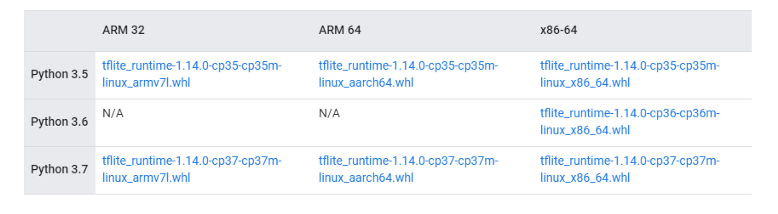
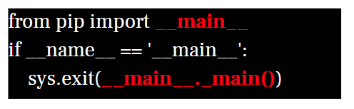

此為EdgeTpu執行環境所需安裝操作筆記，雖然並未在實體主機上進行操作，而是使用虛擬機來進行，但是，在虛擬機上所有步驟操作，跟實體主機上操作差異並不大。

<!--more-->

有關於虛擬機如何安裝Ubuntu 18.04部份，並不會出現在此筆記上進行步驟講解介紹，需自行完成此部分安裝設置。

此筆記內容是從虛擬機已安裝完畢系統，並從一個正常啟動系統起點開始。

---

## 執行環境

* 作業系統：Windows10
* 虛擬機：VMWare WorkStation Player 15
* 映像檔：: Ubuntu 18.04
* 程式語言：Python3.6
* Tensorflow版本：1.15.2
* 其他設備：Google Coral USB Accelerator

關於虛擬機如何跟Google Coral USB Accelerator進行連接使用

將裝置連接至電腦USB，並根據彈出詢問連接至何處詢問視窗，設置連接到指定虛擬機器。

[New USB Device Detected ]→ **Connect to a virtual machine**

需注意!! 當選擇**Connect to host**時，虛擬機是沒辦法讀取的到 Google Coral USB Accelerator，也就是沒有掛載進去虛擬機裡面。


我們可以在以下項目步驟中確認USB裝置連接狀態

[Player] →[Removable Devices] →[Global Unichip Usb Device] →**Connect(Disconnect from host)**

首先，需要確認在[Removable Devices]裡面是否有出現[Global Unichip Usb Device] ，這是Windows上識別Google Coral USB Accelerator裝置代稱。


**關於自製安裝與範例腳本與執行流程**

自製安裝腳本可取得來源： <br/>
[https://github.com/s123600g/Edgetpu_Install_Script](https://github.com/s123600g/Edgetpu_Install_Script)


執行安裝腳本流程如下圖：


執行範例腳本流程如下圖：


關於範例部份，分為二個不同執行區塊，第一個區塊為使用官方範例，第二個區塊為使用自己寫的語音模型範例，兩者皆是以Classification模式下去進行。

**第一區塊使用官方範例，這裡有分成使用 TensorFlowLiteAPI 與 EdgeTPUAPI**
1. `EdgeTpu_TensorFlowLiteAPI_Examples_Install.sh`
2. `EdgeTpu_TensorFlowLiteAPI_Examples_Run.sh`
3. `EdgeTpu_EdgeTPUAPI_Examples_Run.sh`

看到這裡你應該會有一個疑問，為什麼會區分這兩者，又不同在哪裡?

TensorFlowLiteAPI是屬於使用Tensorflow Lite官方原始API，進行調用模型運作Classfication範例運作。

關於TensorFlow Lite 可參考[Get started with TensorFlow Lite](https://www.tensorflow.org/lite/guide/get_started)

關於EdgeTpu使用TensorFlowLiteAPI可參考[Run inference with TensorFlow Lite in Python](https://coral.ai/docs/edgetpu/tflite-python/)

如果是使用TensorFlowLiteAPI，你應該要注意關於 TensorFlow Lite interprete安裝注意事項[Install just the TensorFlow Lite interpreter](https://www.tensorflow.org/lite/guide/python#install_just_the_tensorflow_lite_interpreter)


EdgeTPUAPI是Google Coral團隊為EdgeTpu打造自製 API，簡化了程式碼開發上所需要的架構，透過簡化的API提供的函式庫，可以更簡單地從調用EdgeTpu裝置到運作執行操作，官方目前提供了兩種主要執行模式，一種為Classification，另一種為Detection。

可以參考[Edge TPU Python API overview](https://coral.ai/docs/edgetpu/api-intro/)

**第二區塊使用自己寫的語音模型範例** <br/>

`Download_ASR_Demo.sh`

此為[使用EdgeTpu應用在語音模型預測之簡單實例](https://s123600g.github.io/google/edgetpu/2019/07/20/%E4%BD%BF%E7%94%A8EdgeTpu%E6%87%89%E7%94%A8%E5%9C%A8%E8%AA%9E%E9%9F%B3%E6%A8%A1%E5%9E%8B%E9%A0%90%E6%B8%AC%E4%B9%8B%E7%B0%A1%E5%96%AE%E5%AF%A6%E4%BE%8B(%E4%B8%80)-%E5%89%8D%E8%A8%80%E8%88%87%E9%96%8B%E7%99%BC%E7%92%B0%E5%A2%83%E9%85%8D%E7%BD%AE.html)之範例，再此不再贅述內容介紹。

---

## 執行安裝設置

<br/>

### Step 1.確認Pyhton3-pip

確認能夠正常顯示Package清單

```shell
pip3 list
```

如果能夠正常顯示Package清單，那就是完成這一步設置，以下是為正常顯示操作。


如果未正常顯示代表未安裝python3-pip，執行下列指令進行安裝

```shell
sudo apt-get install python3-pip
```


### Step 2.安裝EdgeTPU執行環境

使用安裝腳本`EdgeTpu_ENV_Install.sh`

```shell
sudo bash EdgeTpu_ENV_Install.sh
```


此腳本主要執行內容為以下步驟：<br/>

**1. 安裝EdgeTPU Runtime** <br/>

```shell
# 將Package來源清單加入至系統套件來源名單
echo "deb https://packages.cloud.google.com/apt coral-edgetpu-stable main" | sudo tee /etc/apt/sources.list.d/coral-edgetpu.list

# 下載來源清單驗證金鑰並加入至套件金鑰管理
curl https://packages.cloud.google.com/apt/doc/apt-key.gpg | sudo apt-key add -

# 執行所有套件資訊更新
sudo apt-get update

# 進行安裝EdgeTPU runtime library(此為一般標準模式，也就是標準效能運作)
sudo apt-get install -y libedgetpu1-std

# 如果需要最大效能模式，請改安裝下面EdgeTPU runtime library(需要搭配USB3.0)
sudo apt-get install libedgetpu1-max
```

**2. 安裝EdgeTPU Python API** <br/>

```shell
# 安裝EdgeTPU官方Python API 函式庫
sudo apt-get install -y python3-edgetpu
```

**3. 安裝EdgeTPU Examples** <br/>

```shell
# 安裝EdgeTPU官方Python提供範例包與程式環境設置
sudo apt-get install -y edgetpu-examples
```
- 安裝完畢範例資料夾會存在`/usr/share/edgetpu/examples/`


### Step 3.安裝EdgeTPU Compiler

使用安裝腳本`EdgeTpu_Compiler_Install.sh`

```shell
sudo bash EdgeTpu_Compiler_Install.sh
```


此腳本主要執行內容為以下：
```shell
# 下載來源清單驗證金鑰並加入至套件金鑰管理
curl https://packages.cloud.google.com/apt/doc/apt-key.gpg | sudo apt-key add -

# 將Package來源清單加入至系統套件來源名單
echo "deb https://packages.cloud.google.com/apt coral-edgetpu-stable main" | sudo tee /etc/apt/sources.list.d/coral-edgetpu.list

# 執行所有套件資訊更新
sudo apt-get update# 進行安裝EdgeTPU Compiler
sudo apt-get install -y edgetpu-compiler
```

### Step 4.安裝TensorFlow Lite library

此步驟沒有安裝腳本，需要進行手動操作。


如果是使用TensorFlowLiteAPI來調用EdgeTPU執行，需要完成此步驟安裝，它的功能就跟EdgeTPU runtime是一樣，需要有它才能進行運作。

使用Python wheel形式安裝(.whl 檔案)，安裝檔案可至以下連結內找到下載，並有說明可以參考 <br/>
[Python quickstart - Install just the TensorFlow Lite interpreter](https://www.tensorflow.org/lite/guide/python#install_just_the_tensorflow_lite_interpreter)

因為是在PC平台上運作，所以需要選擇 x86-64平台，對應Python版本有3.5、3.6、3.7，依據自己所使用版本選擇，此筆記範例所使用是3.6



此筆記範例所使用是3.6 --> `tflite_runtime-1.14.0-cp36-cp36m-linux_x86_64.whl`

以虛擬機環境為例，以下為安裝指令操作

```shell
# 切換到檔案所在位置底下
cd /home/coral_user/Coral_Install/TensorFlow Lite interpreter

# 進行Python Package安裝
pip3 install tflite_runtime-1.14.0-cp36-cp36m-linux_x86_64.whl
```


---

## 執行範例 image-classification

<br/>

### TensorFlow Lite library

可參考[Run a model using the TensorFlow Lite API](https://coral.ai/docs/accelerator/get-started#3-run-a-model-using-the-tensorflow-lite-api)


**使用安裝腳本-`EdgeTpu_TensorFlowLiteAPI_Examples_Install.sh`** <br/>

```shell
sudo bash EdgeTpu_TensorFlowLiteAPI_Examples_Install.sh
```


```shell
# 安裝git 套件
sudo apt install -y git

# 建立範例存放目錄並在建立完成後切換至該位置
mkdir coral && cd coral

# 透過 git clone 下載官方範例
git clone https://github.com/google-coral/tflite.git

# 切換至指定範例目錄結構內
cd tflite/python/examples/classification

# 執行範例所需環境配置安裝腳本
bash install_requirements.sh

# 更動該範例存在目錄結構權限，防止執行時會出現權限錯誤問題
sudo chmod 777 /home/coral_user/Coral_Install/coral/*
sudo chmod 777 /home/coral_user/Coral_Install/coral/tflite/*
sudo chmod 777 /home/coral_user/Coral_Install/coral/tflite/python/*
sudo chmod 777 /home/coral_user/Coral_Install/coral/tflite/python/examples/*
sudo chmod 777 /home/coral_user/Coral_Install/coral/tflite/python/examples/classification/*
sudo chmod 777 /home/coral_user/Coral_Install/coral/tflite/python/examples/classification/models/*
sudo chmod 777 /home/coral_user/Coral_Install/coral/tflite/python/examples/detection/*
```

**使用範例腳本-`EdgeTpu_TensorFlowLiteAPI_Examples_Run.sh`** <br/>

```shell
sudo bash EdgeTpu_TensorFlowLiteAPI_Examples_Run.sh
```


**執行範例程式** <br/>

```shell
# 主程式檔案 classify_image.py
# 第一個參數 --model 指定使用tflite模型來源
# 第二個參數 --labels 指定分類標籤來源
# 第三個參數 --input 指定輸入圖片來源
python3 /home/coral_user/Coral_Install/coral/tflite/python/examples/classification/classify_image.py \
--model /home/coral_user/Coral_Install/coral/tflite/python/examples/classification/models/mobilenet_v2_1.0_224_inat_bird_quant_edgetpu.tflite \
--labels /home/coral_user/Coral_Install/coral/tflite/python/examples/classification/models/inat_bird_labels.txt \
--input /home/coral_user/Coral_Install/coral/tflite/python/examples/classification/images/parrot.jpg
```

### 使用EdgeTPU API

可參考[Edge TPU API overview](https://coral.ai/docs/edgetpu/api-intro/#edge-tpu-api-overview)

**使用範例腳本-`EdgeTpu_EdgeTPUAPI_Examples_Run.sh`** <br/>

```shell
sudo bash EdgeTpu_EdgeTPUAPI_Examples_Run.sh
```


**執行範例程式** <br/>

```shell
# 主程式檔案 classify_image.py
# 第一個參數 --model 指定使用tflite模型來源
# 第二個參數 --labels 指定分類標籤來源
# 第三個參數 --input 指定輸入圖片來源
python3 /usr/share/edgetpu/examples/classify_image.py \
--model /usr/share/edgetpu/examples/models/mobilenet_v2_1.0_224_inat_bird_quant_edgetpu.tflite \
--label /usr/share/edgetpu/examples/models/inat_bird_labels.txt \
--image /usr/share/edgetpu/examples/images/parrot.jpg
```

---

## 執行範例 audio-classification

可參考[使用EdgeTpu應用在語音模型預測之簡單實例](https://medium.com/@s123600g/%E4%BD%BF%E7%94%A8edgetpu%E6%87%89%E7%94%A8%E5%9C%A8%E8%AA%9E%E9%9F%B3%E6%A8%A1%E5%9E%8B%E9%A0%90%E6%B8%AC%E4%B9%8B%E7%B0%A1%E5%96%AE%E5%AF%A6%E4%BE%8B-%E4%B8%80-%E5%89%8D%E8%A8%80%E8%88%87%E9%96%8B%E7%99%BC%E7%92%B0%E5%A2%83%E9%85%8D%E7%BD%AE-d8720eb0d970)(ASR_Demo)介紹


**使用安裝腳本-`Download_ASR_Demo.sh`** <br/>

```shell
. Download_ASR_Demo.sh
```

腳本內容如下：

```shell
# 下載放置在Google雲端硬碟專案範例壓縮檔
wget --no-check-certificate -r 'https://docs.google.com/uc?export=download&id=1-Z5BAUND5Jq9yISo-n-cYWx115Rpwu4R'  -O 'Audio_Speech_Recognition_TPU_Demo20191207.zip' 

# 將下載完專案壓縮檔進行解壓縮
unzip Audio_Speech_Recognition_TPU_Demo20191207.zip -d ~/ 
```

配置安裝Python 所需Package，透過專案目錄內`requirement_coral.txt`需求清單，進行Package清單依序安裝

安裝指令：

```shell
pip3 install -r requirement_coral.txt
```

安裝完畢後再執行一次 pip3 list 會發現以下錯誤 ：


原始`/usr/bin/pip3`內容


修正後`/usr/bin/pip3`內容



在 ASR_Demo 專案包內主要程式清單：

1. `Config.py`，參數配置程式檔。
2. `Gen_Datafile.py`，主要用來自動產生各分類語音特徵文字檔。
3. `Train_Data.py`，產生資料集、量化訓練、產生訓練後pb模型。
4. `Model_pb_to_tflite.py`，將pb模型轉換成tflite模型。
5. `classify_ASR.py`，執行語音分類識別，使用EdgeTpu Python API。
6. `Prediction.py`，執行語音分類識別，使用Keras模型。

**執行模型訓練** <br/>

執行指令：

```shell
python3 Train_Data.py
```

最後結果會放置在專案資料夾內：
* `model/model_pb/frozen_model.pb` → 訓練好pb模型
* `log_file/model_visualized.png` → 模型結構可視化圖片
* `log_file/Graph.png.png` → Tensorboard模型結構可視化圖片

**執行模型轉換tflite** <br/>

執行指令：

```shell
python3 Model_pb_to_tflite.py
```

* 輸入來源在 ASR_Demo 專案目錄內 ：
  - `model/model_pb/frozen_model.pb`
* 輸出位置在 ASR_Demo 專案目錄內 ：
  - `tflite_model/ASR_Model.tflite`
* 測試資料在 ASR_Demo 專案目錄內 ：
  - `tflite_model/valid_data/down/29dce108_nohash_3.txt`


**執行Edgetpu_Compiler** <br/>

執行指令：

```shell
edgetpu_compiler -s /home/coral_user/Coral_Install/Audio_Speech_Recognition_TPU_Demo20191207/tflite_model/ASR_Model.tflite
```
* 輸入來源在 ASR_Demo 專案目錄內 ：
  - `tflite_model/ASR_Model.tflite`
* 輸出位置在 ASR_Demo 專案目錄內 ：
  - `tflite_model/ASR_Model_edgetpu.tflite`
* 日誌位置在 ASR_Demo 專案目錄內 ：
  - `tflite_model/ASR_Model_edgetpu.log`

**執行 Audio-Classification** <br/>

執行指令：

```shell
python3 classify_ASR.py
```


---
