<!--more-->

根據官方在2020/01/29釋出消息來看，現在Windows 10也可以透過Google Coral USB Accelerator來運行EdgeTpu，消息來源可以參考 <br/>
[January 2020 Updates
Edge TPU runtime now available for Mac and Windows
January 29, 2020](https://coral.ai/news/updates-01-2020/)

此筆記以目前釋出版本資訊內容進行設置操作與範例運行。

---

## 執行環境

* 作業系統：Windows10 專業版 1909
* 程式語言：Python3.6
* Tensorflow版本：
  - tensorflow 1.15.2
  - tflite-runtime 2.1.0
* 其他工具：Anaconda ，用來建立Python虛擬環境
* 其他設備：Google Coral USB Accelerator

在開始之前你需要先在下方連結 <br/>
[https://coral.ai/software/#edgetpu-python-api](https://coral.ai/software/#edgetpu-python-api)

下載好`download edgetpu_runtime_*.zip`並將檔案解壓縮完成

使用範例-->`download edgetpu_runtime_20200128.zip`

關於 tensorflow 1.15.2 來源可參考 <br/>
[https://pypi.org/project/tensorflow/1.15.2/#files](https://pypi.org/project/tensorflow/1.15.2/#files)

關於Anaconda部份，沒有要求一定需要，可自行決定是否使用。

---

## 執行安裝設置

<br/>

### Step 1. 安裝Edge TPU runtime

開啟PowerShell切換到下載好並解壓縮出來的`edgetpu_runtime`資料夾目錄內，並執行以下指令進行安裝

```shell
.\install.bat
```

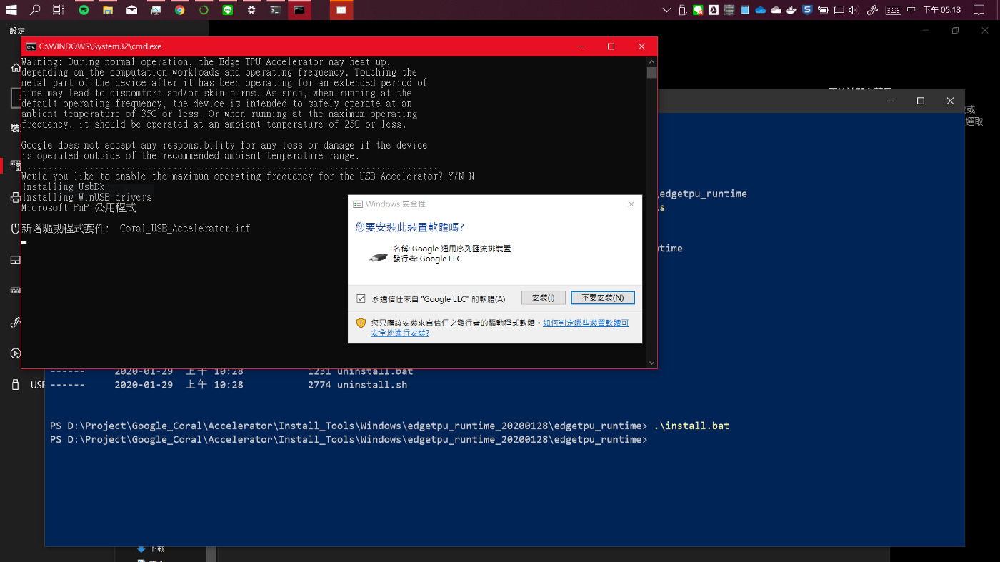

會出現是否安裝此裝置視窗訊息，點選安裝進行下一步，當看到以下畫面時，代表已經安裝完成。

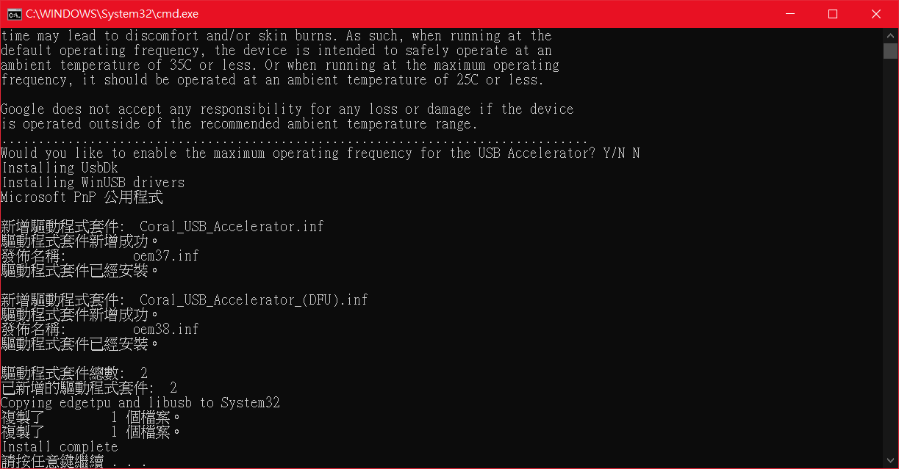

### Step 2. 建立虛擬環境(如果沒有使用Anaconda，可跳過此步驟)

**1. 開啟Anaconda Prompt** <br/>

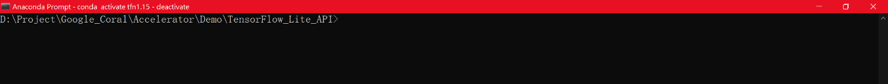

**2. 建立虛擬環境** <br/>

```shell
conda create -n test_tfn python=3.6
```

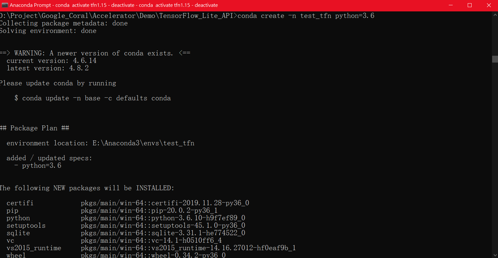

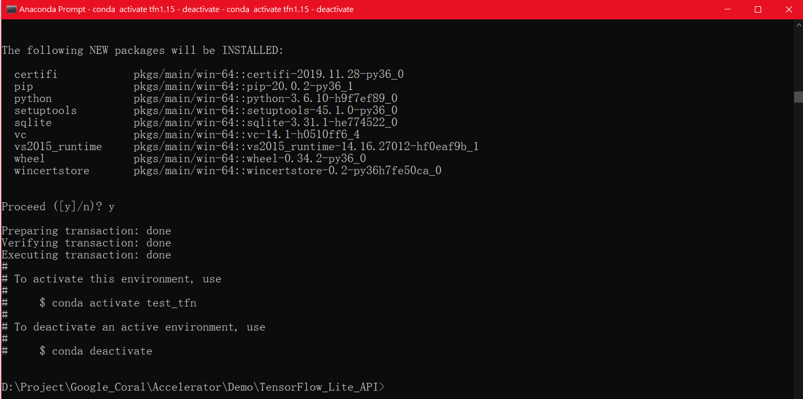


### Step 3. 安裝TensorFlow Lite library

**1. 進入虛擬環境**

如果未使用Anaconda，請跳過此步驟

```shell
# Anaconda進入虛擬環境指令
conda activate test_tfn

# 如果要離開Anaconda虛擬環境，指令如下
conda deactivate
```

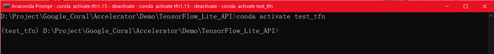


**2. 進行環境安裝**

安裝 tensorflow，版本使用1.15.2

```shell
pip install tensorflow==1.15.2
```

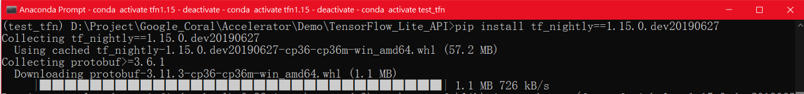


安裝 TensorFlow Lite interpreter

如果是使用TensorFlowLiteAPI來調用EdgeTPU執行，需要完成此步驟安裝，它的功能就跟EdgeTPU runtime是一樣，需要有它才能進行運作。

有關內容說明可以參考 <br/>
[Python quickstart — Install just the TensorFlow Lite interpreter](https://www.tensorflow.org/lite/guide/python#install_just_the_tensorflow_lite_interpreter)

```shell
pip install https://dl.google.com/coral/python/tflite_runtime-2.1.0-cp36-cp36m-win_amd64.whl
```

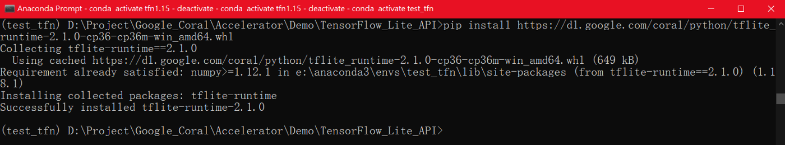


### Step 4. 安裝Edge TPU Python API

如果是使用 EdgeTPU API來調用EdgeTPU執行，需要完成此步驟安裝才能進行運作。

安裝連結可至以下連結內參考 <br/>
[Edge TPU Python API for Mac and Windows](https://coral.ai/software/#edgetpu-python-api)

```shell
pip install https://dl.google.com/coral/edgetpu_api/edgetpu-2.13.0-cp36-cp36m-win_amd64.whl
```

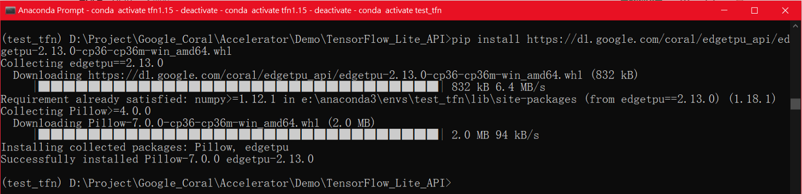

---

## 執行範例

範例所使用模型與資料來源可參考以下連結取得 <br/>
[https://github.com/google-coral/edgetpu/tree/master/test_data](https://github.com/google-coral/edgetpu/tree/master/test_data)

### Step 1. 使用 TensorFlowLiteAPI

關於範例來源可參考
* [https://github.com/google-coral/tflite/tree/master/python/examples](https://github.com/google-coral/tflite/tree/master/python/examples)
* [https://coral.ai/docs/edgetpu/tflite-python/](https://coral.ai/docs/edgetpu/tflite-python/)

**image classification example** <br/>

```shell
python classify_image.py --model mobilenet_v2_1.0_224_inat_bird_quant_edgetpu.tflite --label inat_bird_labels.txt --input parrot.jpg
```

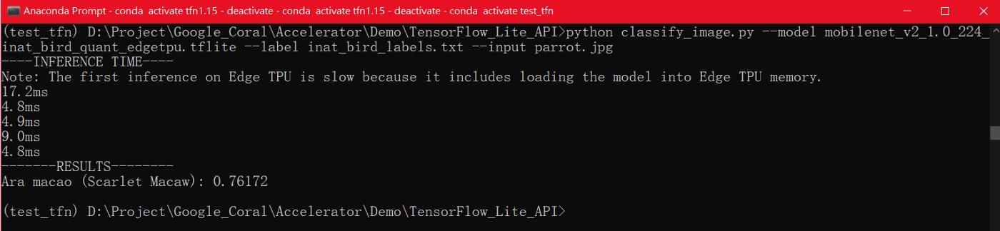

**object detection example** <br/>

```shell
python detect_image.py --model mobilenet_ssd_v2_coco_quant_postprocess_edgetpu.tflite --labels coco_labels.txt --input grace_hopper.bmp --output grace_hopper_processed.bmp
```

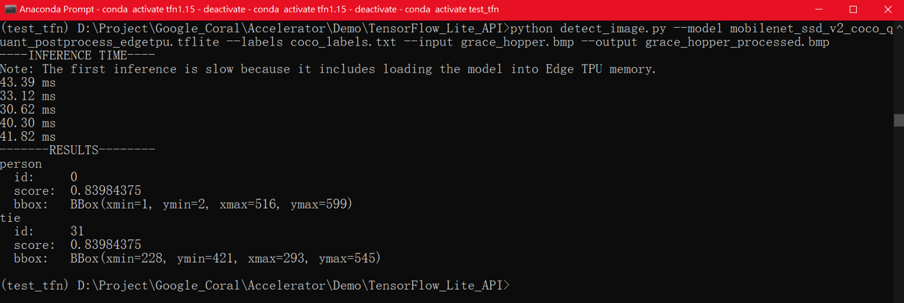

### Step 2. 使用 EdgeTPU API

可參考[Edge TPU API overview](https://coral.ai/docs/edgetpu/api-intro/)


**image classification example** <br/>

```shell
python classify_image.py --model mobilenet_v2_1.0_224_inat_bird_quant_edgetpu.tflite --label inat_bird_labels.txt --image parrot.jpg
```

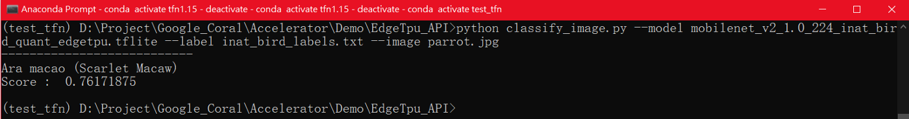

**object detection example** <br/>

```shell
python object_detection.py --model mobilenet_ssd_v2_face_quant_postprocess_edgetpu.tflite --input face.jpg --output detection_results.jpg
```

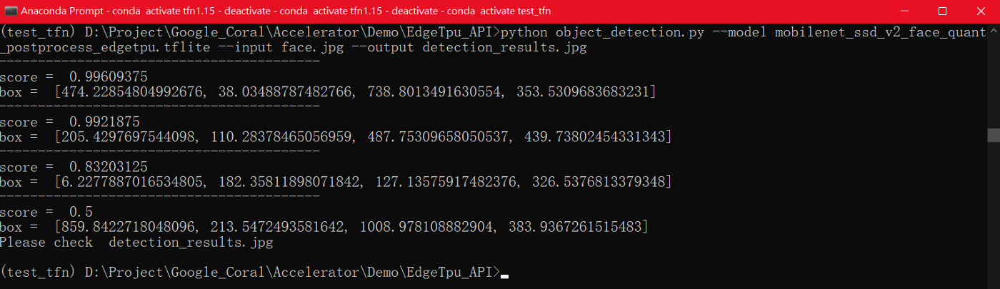

---
### 相關參考
* [https://coral.ai/docs/accelerator/get-started/#1c-on-windows](https://coral.ai/docs/accelerator/get-started/#1c-on-windows)
