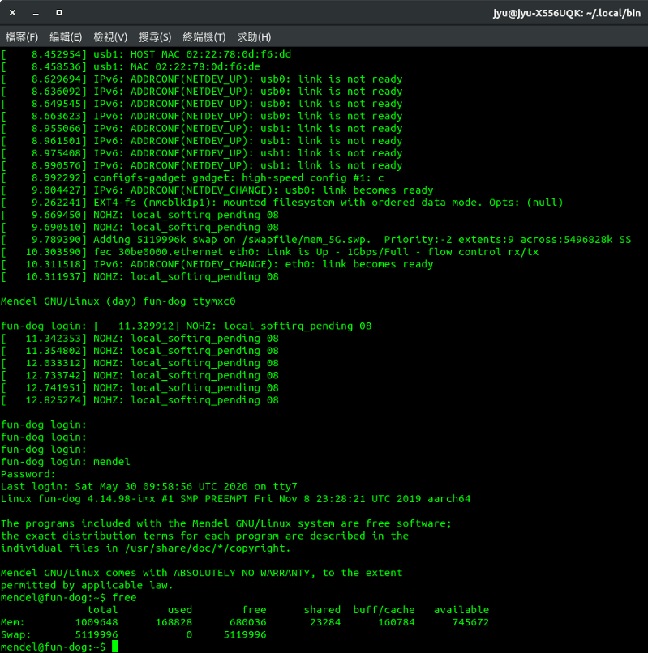

<!--more-->

Google Coral Dev Board預設配置只有1G記憶體，在使用上可能會碰到記憶體吃盡情況下，就需要在建立一個虛擬記憶體來進行分配，在空間使用上透過外接SD卡來建立一個分割磁區，放置Swap使用來源空間配置。

需要做的配置動作有：
1. 外接掛載SD卡上分割緩衝記憶體空間。
2. 建立虛擬記憶體。
3. 設置開機登入自動掛載虛擬記憶體。


## 外接掛載SD卡上分割緩衝記憶體空間

Step 1.查看目前磁區掛載狀態

```shell
sudo fdisk -l
```

Step 2.選擇SD卡磁區進行操作管理

```shell
sudo fdisk /dev/mmcblk1p1
```

Step 3.刪除SD卡磁區

```shell
Command (m for help): d
```

Step 4.新增SD卡磁區

```shell
Command (m for help): n

Partition type
   p   primary (0 primary, 0 extended, 4 free)
   e   extended (container for logical partitions)
Select (default p): p

Partition number (1-4, default 1): (預設就好，直接按Enter下一步)

First sector (2048-20971519, default 2048): (預設就好，直接按Enter下一步)

Last sector, +/-sectors or +/-size{K,M,G,T,P} (2048-20971519, default 20971519): +5G (這裡我設定使用5G)
```

Step 5.儲存建立動作

```shell
Command (m for help): w
```

---

## 建立虛擬記憶體

SD卡磁區掛載對應在 Dev Board內`/swapfile`，如果沒有存在`/swapfile`，請先執行以下指令建立此位置。

```shell
sudo mkdir /swapfile
```

操作之前記得要先掛載SD卡磁區至`/swapfile`

```shell
sudo mount  /dev/mmcblk1p1  /swapfile
```

Step 1.建立Swap設定區塊檔

```shell
cd /swapfile
sudo dd if=/dev/zero of=./mem_5G.swp bs=1024 count=5120000
```

* `if` → 來源配置區塊，此處設為/dev/zero代表沒有使用的來源區塊。
* `of` → 輸出配置區塊設定檔，為虛擬記憶體配置檔。
* `bs` → 區塊配置單位大小，假設為1024代表一個區塊單位為1024 byte，也就是1KB。
* `count` → 總共有幾個區塊數量，如果要設定為5G換算為5000(MB)*1024 = 5120000 (KB)。

Step 2.轉換Swap設定區塊檔為系統檔

```shell
sudo mkswap /swapfile/mem_5G.swp
```

Step 3.啟用Swap

```shell
sudo swapon /swapfile/mem_5G.swp
```

啟用來源為已經轉換為系統檔的Swap設定區塊檔。

Step 4.確認Swap啟用狀態

```shell
free
```

## 設置開機登入自動掛載虛擬記憶體

Step 1.在`/usr/local/sbin/`建立一個`swapon.sh`

```shell
sudo nano /usr/local/sbin/swapon.sh
```

`swapon.sh`內容：

```bash
#!/bin/bash# 掛載SD卡進/swapfile
sudo mount /dev/mmcblk1p1 /swapfile
# 啟用虛擬記憶體
sudo swapon /swapfile/mem_5G.swp
```

Step 2.在`/etc/systemd/system/`建立一個`swapon.service`

```shell
sudo nano /etc/systemd/system/swapon.service
```

`swapon.service`內容:

```conf
[Unit]
Description=Swap On
After=getty.target

[Service]
ExecStart=/usr/local/sbin/swapon.sh
Type=notify
NotifyAccess=all
StandardError=syslog

[Install]
WantedBy=multi-user.target
```

Step 3.啟用服務(開機登入會自動啟用服務)

```shell
sudo systemctl enable /etc/systemd/system/swapon.service
```

Step 4.查看服務狀態

```shell
systemctl status swapon.service
```

Step 5.重開機Dev Board，並且登入查看是否有自動正常掛載Swap

```shell
sudo reboot
```

開完機登入後，執行以下指令查看是否有正確掛載虛擬記憶體

```shell
free
```



---

