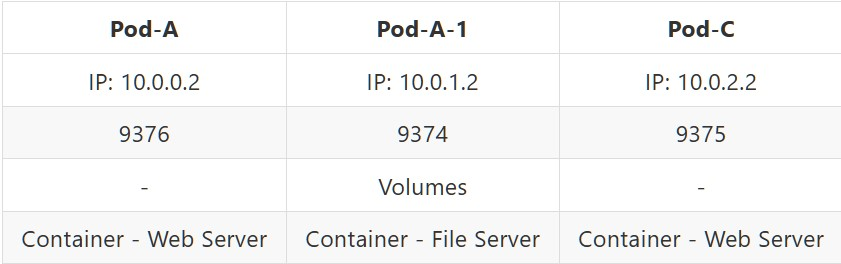
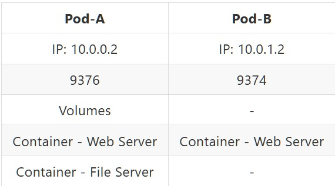
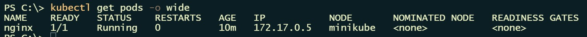
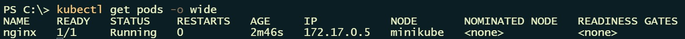
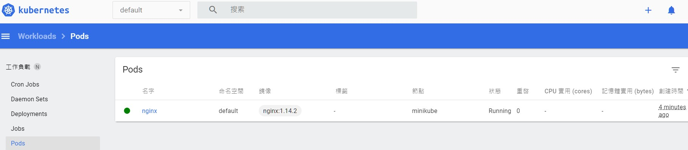
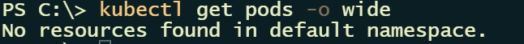

<!--more-->

[Kubernetes - Pod](https://kubernetes.io/docs/concepts/workloads/pods/)

Pod是Kubernetes中附屬於Node節點，也是整體架構最基礎底層單位，它負責運行我們熟知容器(Container)，一個Pod可運載多個容器裡面也有共用資源(Volumes、NetWork)，整個Pod內部容器都都是共享這些資源，有共享檔案空間就使用Volumes，在NetWork方面Pod會有一組IP和Port作為代表，針對不同Pod之間容器溝通，就是使用這些IP和Port進行溝通。

---

## 運行實例種類

Pod我們所知可以運作單個或多個容器，所以在Pod內部容器規劃可以分成以下
* 單個容器Pod
    * 一個Pod只運作一個容器，將Pod視為服務容器個體，而不是容器運作環境。
    * 目前最常見規劃使用方式，在管理面上是針對Pod而不是容器，因容器是由Pod驅使運作，只要Pod實體建置起來，服務基本上就隨著建置完成而開始運行。
* 多個容器Pod
    * 一個Pod內運作多個容器，將Pod視為運作容器基底環。

通常會由Pod Template和工作附載控制器(Ex：Deployment)搭配，管理設置整體服務運作。

[Workload resources for managing pods](https://kubernetes.io/docs/concepts/workloads/pods/#workload-resources-for-managing-pods)

Pod規劃還是需要按照實際需求做設計，依據官方文件說明，Pod除了可執行多個容器之外，也有設計Pod只單獨運行一個容器，也就是Pod即是容器概念，這是普遍最常見規劃方式，除非你的容器應用之間有緊密耦合關係，才有可能使用Pod內有多個容器這種進階規劃。

假設有兩個服務分別是A和B，各服務所需應用組成如下：
* A服務是一個檔案存取下載服務
    * Web Server
    * File Storge
    * File Server
* B服務是一個單純資訊查詢服務
    * Web Server

依照上述，在同一個Node節點情況下，兩種規劃建置各自如下：

**單個容器Pod**

我們將需要用到應用服務視為獨立個體，A服務會有兩個獨立個體來滿足需求，B服務只需要一個獨立個體滿足需求。

A服務規劃上會有兩個Pod進行，`Pod-A`是Web應用服務，`Pod-A-1`是一個檔案存取功能，檔案存放使用該Pod內部Volume進行檔案存放。



每個Pod都會有獨立NetWork IP和Port，讓Pod與Pod之間能進行溝通，當User使用A服務存取檔案時，`Pod-A`透過`Pod-A-1`NetWork IP和Port去發送存取檔案請求。

[Pod networking](https://kubernetes.io/docs/concepts/workloads/pods/#pod-networking)

B服務規劃上只有單獨Pod進行，由`Pod-B`來滿足服務需求。

**多個容器Pod**

Node裡面Pod分別是Pod-A和Pod-B，各自內容容器結構如下：



我們可以將Pod視為一個服務相關應用集合體，針對A服務對應`Pod-A`，因為是一個檔案存取功能，所以組成除了Web Server之外，檔案存放使用Pod內部Volume進行檔案存放，搭配一個File Server提供檔案管理介面，整體組成才會形成一個完整服務，對於B服務對應`Pod-B`，它只是單純資訊查詢瀏覽服務，所以只需一個Web Server就可組成完整服務。

---

## Pod 簡易操作 - 查詢

搭配`kubectl get`指令來查詢當前Pod運作清單。

關於指令詳細可參考：<br/>
[https://kubernetes.io/docs/reference/generated/kubectl/kubectl-commands#get](https://kubernetes.io/docs/reference/generated/kubectl/kubectl-commands#get)

基本查詢
```shell
kubectl get pods
```


加入`-o wide`參數可以在額外增加顯示資訊
```shell
kubectl get pods -o wide
```



假設想將Name為`mybusybox`Pod輸出其Yaml配置內容在本地，Yaml配置檔為`mybusybox.yaml`
```shell
kubectl get pod mybusybox -o yaml > mybusybox.yaml
```
關於`-o` 參數詳細可參考： <br/>
[https://kubernetes.io/docs/reference/kubectl/#output-options](https://kubernetes.io/docs/reference/kubectl/#output-options)

---

## Pod 簡易操作 - 建置

Pod的建立有兩種操作方式
1. Imperative commands，直接透過指令方式即時生成。
2. Declarative commands，一樣透過指令方式生成，但是還需搭配Yaml配置檔聲明如何建置。

使用minikube單節點進行範例實作。<br/>
[https://minikube.sigs.k8s.io/docs/](https://minikube.sigs.k8s.io/docs/)

### Imperative command

搭配`kubectl run`指令來建立Pod運行。

關於指令詳細可參考<br/>
[https://kubernetes.io/docs/reference/generated/kubectl/kubectl-commands#run](https://kubernetes.io/docs/reference/generated/kubectl/kubectl-commands#run)

執行指令建立Pod
```shell
kubectl run mybusybox --image=busybox --command -- bin/sh -c "sleep 100000"
```

* `--image` 指定使用哪種image建置容器
* `--command` 設置當容器運行啟動內部需執行指令

透過以下指令可在終端機查看Pod清單
```shell
kubectl get pods -o wide`
```


### Declarative command

搭配`kubectl create`指令和Yaml配置檔建立Pod運行。

關於指令詳細可參考
[https://kubernetes.io/docs/reference/generated/kubectl/kubectl-commands#create](https://kubernetes.io/docs/reference/generated/kubectl/kubectl-commands#create)

Yaml配置檔使用官方教材範例 - [Pod templates](https://kubernetes.io/docs/concepts/workloads/pods/#using-pods)

Yaml檔案內容：
```yaml
# 定義版本
apiVersion: v1
# 定義此為Pod設定檔
kind: Pod
metadata:
  # 定義此Pod Name
  name: nginx
spec:
  # 設定容器
  containers:
  # 使用Nginx容器
  - name: nginx
    image: nginx:1.14.2
    ports:
    - containerPort: 80
```

執行指令建立Pod，Yaml配置檔來源為網路
```shell
kubectl create -f https://k8s.io/examples/pods/simple-pod.yaml
```
OR

執行指令建立Pod，Yaml配置檔來源為本地
```shell
kubectl create -f ./MyFirstPod.yaml
```

透過以下指令可在終端機查看Pod清單
```shell
kubectl get pods -o wide`
```



minikube Dashboard 管理介面


### Pod 簡易操作 - 刪除

搭配`kubectl delete`指令來刪除特定運行中Pod。

關於指令詳細可參考：<br/>
[https://kubernetes.io/docs/reference/generated/kubectl/kubectl-commands#delete](https://kubernetes.io/docs/reference/generated/kubectl/kubectl-commands#delete)

假設要刪除Name為`nginx`的Pod


執行指令刪除Pod
```shell
kubectl delete pod nginx
```

透過`kubectl get pods`來確認



---