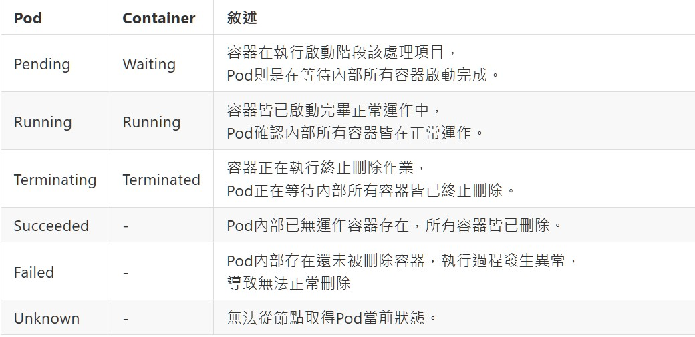

<!--more-->

[Kubernetes - Pod Lifecycle](https://kubernetes.io/docs/concepts/workloads/pods/pod-lifecycle/)

Pod的運行都會有對應執行階段，這些可稱為執行狀態讓使用者清楚當前Pod是否還活著，同樣地，Pod內部的也會運行單一或多個容器，這些容器也會有執行狀態，兩者是相互有關係驅動整體執行狀態識別。

當使用者詢問Pod當前執行狀態流程如下：
1. 詢問Kubernetes API Server(Master)，並轉送Pod所在Node內Kubelet。
2. Kubelet收到詢問請求，開始確認Pod運作狀態並回覆。
3. Kubernetes API Server收到回覆轉送回應。
4. 使用者看到當前Pod狀態資訊。

Pod與內部Container執行階段對應



---

## Pod 終止執行

[Termination of Pods](https://kubernetes.io/docs/concepts/workloads/pods/pod-lifecycle/#pod-termination)

使用者下達刪除Pod指令後，實際上kubelet發送給Node告知請刪除某Pod目標，有時可能不會馬上就刪除完畢，因給予命令並不是強制終止，而是請進行終止作業程序，預設等待30秒給予完成，如果逾期還未終止則進行強制終止，不管終止作業是否還在進行。

關於刪除指令參數可參考： <br/>
[https://kubernetes.io/docs/reference/generated/kubectl/kubectl-commands#delete](https://kubernetes.io/docs/reference/generated/kubectl/kubectl-commands#delete)

**當執行刪除操作時，調整預設等待時間從30秒變為10秒**

指令刪除透過`--grace-period`參數
```shell
kubectl delete pod <name> --grace-period=10
```

OR

Yaml配置檔在`spec`內新增`terminationGracePeriodSeconds`
```yaml
# 定義版本
apiVersion: v1
# 定義此為Pod設定檔
kind: Pod
metadata:
  # 定義此Pod Name
  name: myfirstpod2
spec:
  # 設置當容器終止時，預設等待作業完成限制時間
  terminationGracePeriodSeconds: 10
  # 設定容器
  containers:
  - name: nginx
    image: nginx:1.14.2
    ports:
      - containerPort: 80
  - name: mybusybox
    image: busybox
    command:
      - sh
      - -c
      - "sleep 1000000"
```

**當執行刪除操作時，不想要等待終止作業需要立即強制刪除**

指令刪除透過`--force`和`--grace-period`參數
```shell
kubectl delete pod <name> --force --grace-period=0
```

---