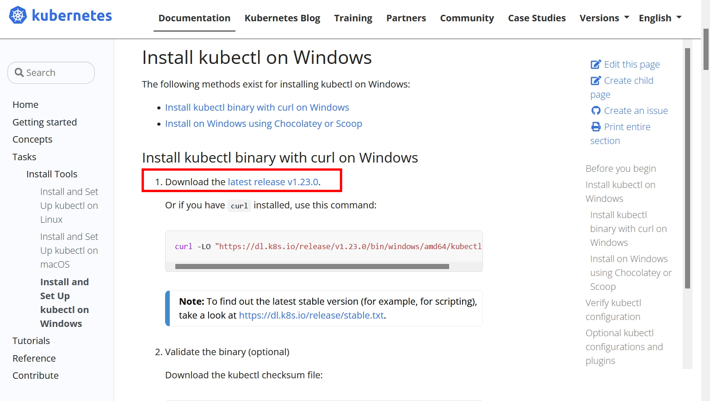
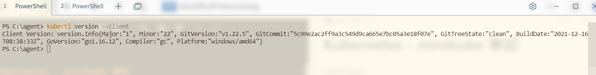
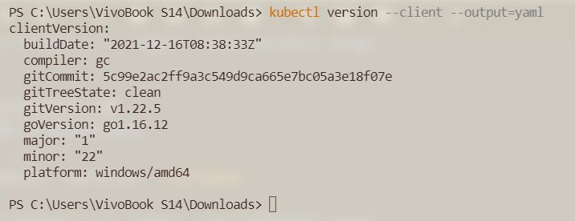
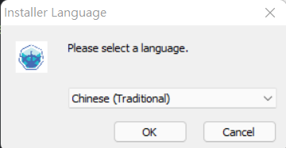
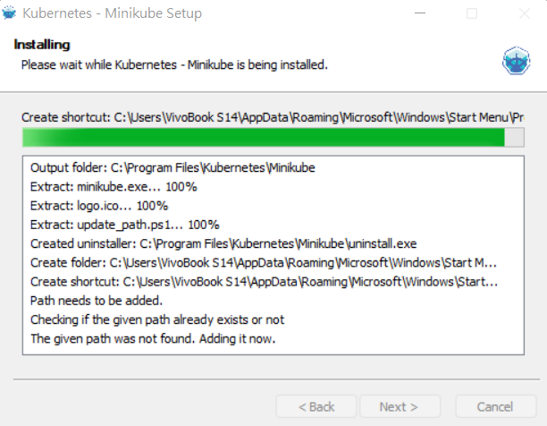
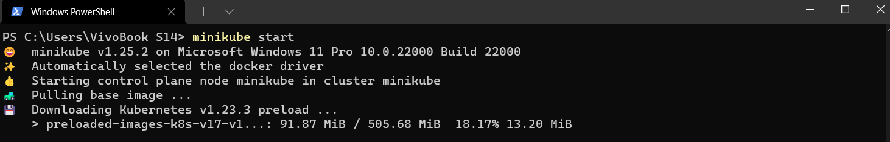
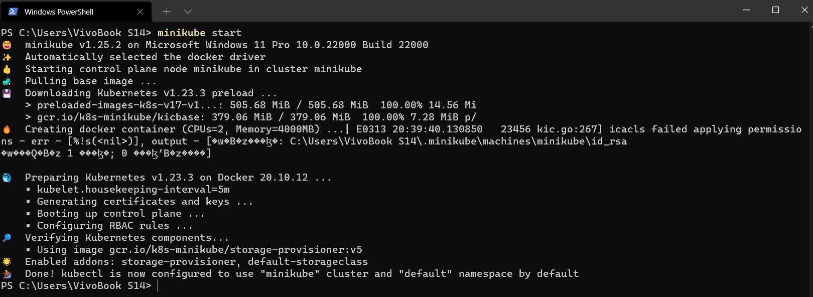
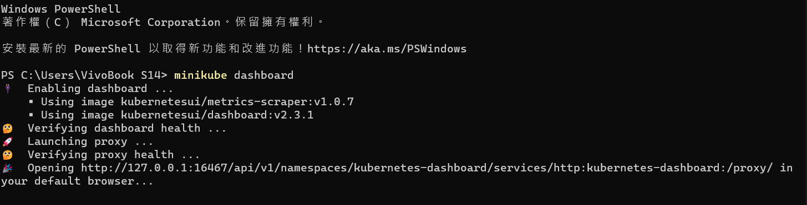
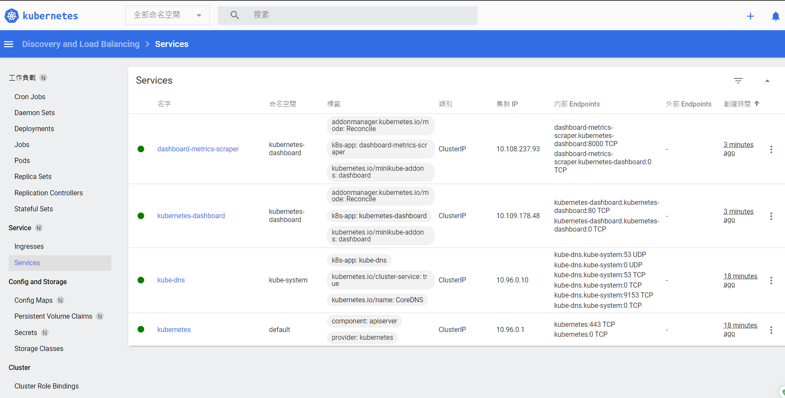
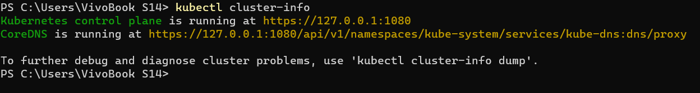

<!--more-->

Install Tools：[https://kubernetes.io/docs/tasks/tools/](https://kubernetes.io/docs/tasks/tools/)

minikube start：[https://minikube.sigs.k8s.io/docs/start/](https://minikube.sigs.k8s.io/docs/start/)

系統需求可參考：[https://minikube.sigs.k8s.io/docs/start/#what-youll-need](https://minikube.sigs.k8s.io/docs/start/#what-youll-need)

minikube GitHub： [https://github.com/kubernetes/minikube](https://github.com/kubernetes/minikube)

Install Docker Desktop on Windows：[https://docs.docker.com/desktop/windows/install/](https://docs.docker.com/desktop/windows/install/)

安裝使用環境
* Windows 11 Pro 10.0.22000 Build 22000
* Docker

安裝順序
1. kubectl
2. minikube

## Windows 安裝 kubectl

[https://kubernetes.io/docs/tasks/tools/install-kubectl-windows/](https://kubernetes.io/docs/tasks/tools/install-kubectl-windows/)

下載 **kubectl.exe** 並執行安裝，不使用執行`curl`操作安裝方式。



測試安裝是否正確
* 顯示安裝版本資訊
```shell
kubectl version --client
```



* 顯示安裝版本資訊(詳細)
```shell
kubectl version --client --output=yaml  
```



## Windows 安裝 minikube

GitHub Release，下載 **minikube-installer.exe** 並執行安裝
[https://github.com/kubernetes/minikube/releases](https://github.com/kubernetes/minikube/releases)





### 執行啟動

開啟**PowerShell**進行以下操作
```shell
minikube start
```



在此階段會設定必要配置與下載執行啟動必要相關套件。



啟動完成後，打開**Docker Desktop**可以看到**minikube**容器運行中。


### 運行 minikube dashboard

```shell
minikube dashboard
```



預設會自動開啟瀏覽器瀏覽頁面



如果不要預設自動開啟瀏覽器，可加上`--url`參數
```shell
minikube dashboard --url
```

使用kubectl指令可查看當前cluster資訊
```shell
kubectl cluster-info
```



---